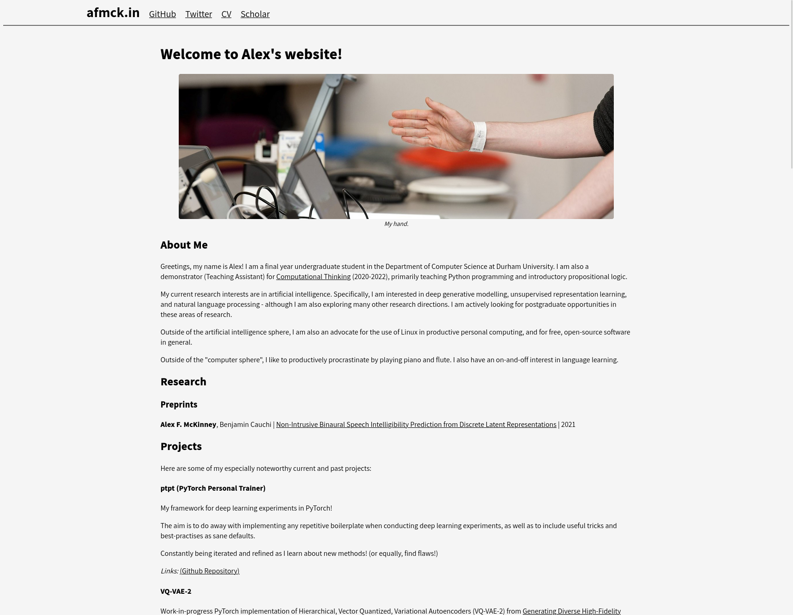

I've had a hankering for a while to completely redo my personal website. There
are a number of reasons for this:

For one, the old site was generated using my own static site generator
[sss](https://github.com/vvvm23/sss). This was more of a project to learn Rust,
rather than a project to build a static site generator. As such, it has not
stood the test of time. Most notably, adding new features is truly awful and the
HTML templates are part of the source code, rather than being separate and thus
easily customisable. I'm not interested enough in web development to invest
a lot of time in refactoring the generator. In essence, my old generator had
a serious case of code-smell.

Hence, this time around I'm using an "off-the-open-source" shelf solution
[Hugo](https://gohugo.io/). This was actually quite a lot of work too. Not
because Hugo is hard to use, but finding a template that I liked aesthetically
and also functionally was quite difficult. I must have about 10 different repos
on my computer from trying different themes, writing some content, before then
discarding it entirely. 

A surprising issue was finding a theme I liked, but when I started writing
content, it didn't feel like "my" website - more like the theme author's
website. It is somewhat illogical (as the one I settled on is also very popular)
but at least my original site was all mine, even if it was the dictionary
definition of "graphic design is (not) my passion". I settled on the
[PaperMod](https://adityatelange.github.io/hugo-PaperMod/) theme, used in my
favourite blog [Lil'Log](https://lilianweng.github.io/).

Another reason to nuke the old site was that I had a number of old posts that
didn't meet my current standards or even had errors in the content. This is an
issue with the human condition more than anything: as we learn more we also see
flaws in our earlier work (as well as become even more aware of what we don't
know). No doubt this will continue, but I should endeavour at least in the
future to leave old work up.

For posterity's sake, my old site looked like this:

> A certain charm to it ~

I've recently completed all my university coursework and exams, so I'm hoping in
the future I'll have more time to write than I did when I was a student. I think
a nicer writing workflow, more time, and perhaps a more casual style, should
(hopefully) do wonders.
