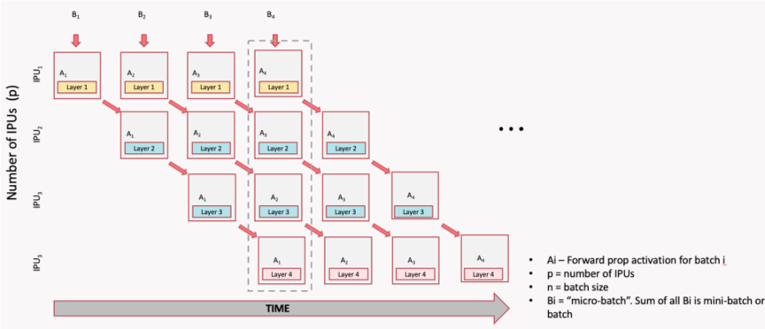

<!-- See how this looks online -->

> *Royal York Crescent, Bristol.*

It has been nearly half a year since I started my first real job as a
fully-fledged graduate. This has taken the form of being an AI Engineer at
Graphcore, a UK-based AI accelerator startup. In quite a short amount of time, I
have learned a great great deal and I am grateful for the opportunity and the
patience of my colleagues – the latter of which is particularly needed when
tutoring the average, fresh compsci graduate.

Chief among what I have learned is a wide array of parallelism strategies. If
you are at least somewhat familiar with Graphcore's **IPU** accelerators, you
will know why. But for the uninitiated, the amount of on-chip memory that can
be directly accessed without hassle on an IPU, is considerably smaller than the
GPUs of today. Luckily, it has a substantial amount of secondary DRAM memory - 
also on IPU - so offloading is faster than it would be to CPU. Nevertheless,
though the IPU has a number of advantages versus a GPU, the reduced size
does mean that resorting to parallelism is more common.

Though that doesn't sound great, if you stop to consider the fast growing model
sizes in the deep learning community, you will maybe notice that this isn't a
*huge deal* if you are interested in large models. Why is that? Because now mass
parallelism is also required on GPUs. Huge scales are the great equaliser it
seems, and a single accelerator of any type can do nought next to the likes of
GPT-3, PaLM, Parti, and friends.

This is exactly the position I found myself in when I landed in Graphcore,
aligning myself quickly on the large model side of things. Conceptually,
parallelism in deep learning is not tricky, but regarding implementations I
still have a ways to go. For now though, I will share what I have learned on
this topic. 

Luckily, the concepts are agnostic to the type of compute device used – you
could even treat everything as a desktop CPU, or a graphing calculator – so this
will not be IPU specific nor even framework specific, only high-level concepts.
This means I will not include code examples, but I will link to tutorials and
frameworks that implement the concepts I discuss at the end of each section.

### Working with a Single Device

It's helpful to begin with the single device case. One host (a regular PC with
a CPU and memory), one accelerator we want to run our model on, suppose a GPU,
which has its own processing and memory components. During execution, we load
parameters and data onto the device, and create intermediate data on-device
such as activations and gradients. If you are a deep learning practioner you
should be familiar with this scenario.

You will also be familiar with this other scenario:
<!-- TODO: add real OOM error -->
```
> x = torch.empty(int(1e12), device=device)
OutOfMemoryError: CUDA out of memory. Tried to allocate 3725.29 GiB (GPU 0; 23.69 GiB total capacity; 3.73 GiB already allocated; 18.56 GiB free; 3.75 GiB reserved in total by PyTorch) If reserved memory is >> allocated memory try setting max_split_size_mb to avoid fragmentation.  See documentation for Memory Management and PYTORCH_CUDA_ALLOC_CONF
```
For which you probably have a few solutions you immediately reach for, such as a credit card. 

On-device memory is typically used for the following things:
- Storing model parameters.
- Storing activations.
- Storing gradients.
- Storing optimiser states.
- Storing code.

> Having to store gradients and optimiser states on-device is one reason why
> training models uses more memory than just running inference. This is
> particularly true for more advanced (read: memory-hungry) optimisers like
> Adam.

And potential solutions include the following:
- Switch to a lower floating point precision :right_arrow: less bits used per
  tensor.
- Decrease micro-batch size and compensate with gradient accumulation
  :right_arrow: reduces size of activations and gradients.
- Turn on "no gradient" or "inference mode" :right_arrow: only store current
  activations, no gradients stored. Clearly inference only.
- Sacrifice extra compute for memory savings (ex: recomputation of activations,
  attention serialisation)
- CPU offload :right_arrow: only load tensors onto device when needed,
  otherwise store in host memory.

..among others!

These solutions help a lot in most workflows and can allow for training much
larger models on a single device than you would expect (see [this Microsoft
blog](https://www.microsoft.com/en-us/research/blog/deepspeed-extreme-scale-model-training-for-everyone/)).
However, for one reason or another, this is sometimes just not practical or has
other downsides such as training instability. In such cases, resorting to
parallelism may be necessary.

### Data Parallelism

Arguably one of the simplest forms of parallelism, data parallelism simply takes
all the devices you have, copies model and optimiser parameters and code onto
all of them, then sends different micro-batches to each device. Gradients are
then synchronised between devices, followed by an optimiser step, resulting in
parameter updates. In essence, we use more devices to chew through the dataset
faster, thus obtaining a speedup. It also enables larger (global) batch sizes
without performing too many gradient accumulation iterations.

Note, that the model and optimiser parameters are replicated on all
devices (all replicas). Hence, in order for this parallelism to work, we need to
be able to fit the entire model with a micro-batch size of at least one on a
single replica.

Data parallelism won't directly help fit larger models, but can help increase
the batch size that you likely had to reduce to squeeze the model in
originally. My first encounter with this was during my master's dissertation,
training a VQ-GAN model, where I could only train on a single device with a
micro-batch size of one, but could obtain a global batch size of 16 with 4
devices and 4 gradient accumulation steps. 

Data parallelism is also relatively communication light, as we only need to
all-reduce the gradients whenever we update the optimiser, which could be 
infrequent depending on the number of gradient accumulation steps. This also
reduces the need for high-speed interconnect between replicas, as communication
is infrequent.

To use data parallelism in your code see [this post for PyTorch
fans](https://pytorch.org/tutorials/intermediate/ddp_tutorial.html) and [this
post for Jax](https://www.mishalaskin.com/posts/data_parallel). I also like
[this post by Kevin
Kai-chuang](https://yangkky.github.io/2019/07/08/distributed-pytorch-tutorial.html)
for PyTorch. However, by far the easiest way to add data parallelism to your
code in PyTorch is to use [Huggingface
Accelerate](https://github.com/huggingface/accelerate) which near-perfectly
abstracts away data parallelism, and integrates with powerful libraries like
Deepspeed, right out of the box.

### Pipeline Parallelism

Pipeline Parallelism is used when the entire model is too large to fit on a
single device. The model is split into stages and each stage executed on a
different device, passing activations between neighbouring stages when a
boundary is reached during execution.

For inference, this is extremely good for improving total throughput of the
system as multiple micro-batches can be processed in parallel, with communication only
happening at stage boundaries. Sometimes, even if the model fits on one device,
pipelining can be used to improve throughput like this (at the cost of latency).


> Shamelessly taken from [a tutorial from my job.](https://docs.graphcore.ai/projects/tf-model-parallelism/en/latest/pipelining.html) Same goes for all images in this section on pipelining.

There is a noticeable **gap** at the start of the above inference pipeline. This
is known as the **ramp-up** phase where device utilisation cannot be at 100%.
Clearly stage 3 cannot begin executing micro-batch 1 until stage 1 and 2 are
both done with micro-batch 1. However, in this scheme, once the final stage $N$ has
received the first micro-batch, we reach the **main phase** and reach maximum
utilisation. Once the first stage processes the final micro-batch, we reach the
**ramp-down** stage, as their is simply no more data left to execute on.

For best utilisation, the time to execute each stage should be as balanced as
possible. This is because if one stage finishes early, it may have to wait for
the subsequent stage to be ready before passing on its activations and executing
its next micro-batch. This is easy in relatively homogeneous models like transformers,
where most layers are typically the same size, but difficult in other models
such as Resnets or UNets.

How does this extend to training?

It makes sense for each stage $t$ to also handle its own backwards pass $t$, so
we don't need to copy activations or parameters to multiple devices. However, one
problem is that we cannot handle the backwards for a stage $t$, without having
the results for backwards $t+1, \dots, N$ and the forwards for $t-1, \dots, 1$.

Let's begin with the simplest scheme that meets these conditions:

> Yes, the second set for forward should probably say "B2".

In this scheme, only one micro-batch is in play at a time, leaving all stages
but one idle. After finishing the final stage, we turn around and begin the
backwards pass, again leaving all but one stage idle. Once a full batch is
computed (in other words, after the ramp-down), a weight update is performed.
This means the utilisation is always going to be (at most) $1/N$ of full
utilisation. Clearly extremely inefficient! 
> However, good for debugging purpose!

We can do better with a **grouped pipeline:**


The ramp-up phase almost consists of two "sub-ramp-ups": the first being the
same as the inference ramp-up, followed by a ramp-up of the backwards passes
which alternate with main-phase forward passes. Once the main-stage is reached,
we alternate between forward and backwards passes on all stages.

We can alternate as once a stage $t$ processes the backwards of micro-batch $b$,
it can discard activations and accumulate gradients. It is then ready to process
the next forward pass for micro-batch $b+1$. Like before, a weight update occurs
after a ramp-down phase.

Another approach is to interleave the forwards and backwards passes:


At any given point, half the stages are executing a forward pass, and half a backwards pass. Because of this, the ramp-up and ramp-down phases are much shorter, resulting in a quicker time to maximum utilisation.

The last two schemes have different advantages and disadvantages:
- At any given time, the grouped scheme executes twice as much mini-batches as
the interleaved scheme, meaning more memory is required to store activations
- Grouped schemes executes all forward and backwards together, meaning
communication is less frequent. Interleaved executes separately, resulting in
more communication and also some idle time when forward passes wait for backward
passes – which typically take longer than forward passes. Hence, grouped schemes
are typically faster than interleaved.
- Interleaved ramp-up and ramp-down time is about twice as fast as grouped,
meaning it is quicker to reach full utilisation.

Pipeline parallelism uses much more communication than data parallel, however
less than tensor parallelism, which I will discuss in the next section.
Communication is limited to boundaries between stages, meaning regardless of the
number of stages, each one will send one set of activations, and receive one
set. The communication can be done in parallel between all replicas.

PyTorch has native support for pipelining
[here](https://pytorch.org/docs/stable/pipeline.html) which uses the [GPipe
algorithm](https://arxiv.org/abs/1811.06965). This was used to train larger
transformer models in [this
tutorial](https://pytorch.org/tutorials/intermediate/pipeline_tutorial.html).
Deepspeed provides more advanced pipeline parallelism, which is explained [in
this tutorial](https://www.deepspeed.ai/tutorials/pipeline/). 

Jax, meanwhile, has no native support for pipeline parallelism, but frameworks
around Jax such as Alpa do support it, demonstrated in [this
tutorial](https://alpa.ai/tutorials/pipeshard_parallelism.html). Lack of native
support in Jax likely comes from its emphasis on TPUs, which have high bandwidth
interconnect between all replicas in a TPU pod (versus GPUs which have fast
interconnect only within a host). This means it is preferable to simply use data
and tensor parallelism (more on the latter later) so to avoid pipeline bubbles.

### Tensor Parallelism

What about if a single *layer* is too big to fit on a single replica? Say for
example, a particularly large MLP expansion, expensive self-attention layer, or
a large embedding layer. In such cases, the parameters of a layer can be split
across multiple devices. Partial results are then computed on each device before
materialising the final result by communicating between the replicas.

Take, for example, the MLP block in a standard transformer model that projects a
vector $x$ to and from a space of dimension $d$ and $4d$:

$$h = W_2 \cdot f(W_1 \cdot x + b_1) + b_2 $$
where $f$ is a nonlinear activation function, $W_*$ are the weight matrices, and
$b_*$ are the bias vectors.

To turn this into a tensor parallel layer, do the following:
- Split $W_1$ **row**-wise into $n$ pieces, sending one to each of $n$ replicas.
- Split $b_1$ into $n$ pieces, as above.
- Split $W_2$ **column**-wise into $n$ pieces, sending one to each of $n$ replicas.

Then, given an input $x$, do on each replica $i$:
- Compute $f(W_1^{(i)} \cdot x + b_1^{(i)})$, resulting in a vector $z_i$ of size $4d/n$.
- Compute $W_2^{(i)} \cdot z_i$, resulting in $\hat{h_i}$ of size $d$

This, naturally, does not give the same result. The next part resolves this:
- Communicate between replicas to compute $\sum^n_{i=1} \hat{h_i} $
- On all replicas add $b_2$ (which is identical on all replicas), to get the
final result $h$ on all replicas.

The first operation sums the partial results across all replicas, which means
all replicas have the same value at this point. Then, all replicas identically
compute $b_2$, which still results in the same (and correct) result, despite no
communication happening after this addition.

A nice exercise is to write out mathematically the operations happening here,
and see that we do indeed arrive at the same result. However, I will save myself
~~you~~ the pain here.


> A diagram of a tensor parallel MLP from the Megatron paper.

Another example is an embedding layer in a transformer. We can split the
embedding matrix along the vocabulary dimension, resulting in a shards of shape
$V/n \times d$. All replicas receive the same input tokens and compute the
embedding. However, if any given token falls outside a given replica's valid
range, a zero tensor is instead returned. Then, an all-reduce will rematerialise
the final result, as only one replica (for any given element in the input
sequence) will have a non-zero tensor.

Other examples include splitting attention heads, convolution channels or even
the spatial dimensions themselves, between the replicas.

Regardless of the context tensor parallelism is applied, it should be noted that
communication between replicas in the same tensor parallel group occur much more
frequently than in data parallel groups or between pipeline stages. This means
that time spent communicating compared to actually computing a result increases.
Because of this, replicas in the same tensor parallel group should be placed on
higher bandwidth interconnect, if possible.

Depending on the model size tensor parallelism can be totally unavoidable, but
should be avoided if possible! Of course, exceptions are also possible. One case
is where (suppose) you could not use pipeline parallelism, so in order to fit
the model onto the available devices, you use tensor parallelism
throughout the model, despite no single layer causing an out of memory. This is
somewhat orthogonal to pipeline parallelism: splitting through the model rather
than across.

Support for tensor parallelism in PyTorch is **experimental** (see this
RFC)[https://github.com/pytorch/pytorch/issues/88838] but is supported in
Deepspeed as "tensor-slicing model-parallelism". Tensor parallelism can be
achieved in Jax using [`jax.pjit`](https://irhum.github.io/blog/pjit/).

### All together now..

A keen eyed reader may have noticed that these parallelism strategies should not
be incompatible with one another – perhaps they may even use the term
**orthogonal**. Indeed, when we target very large model sizes, or have
a lot of compute to throw around, we start arranging replicas into hierarchies
and groups.


Take for example, a system with a data parallel factor of $n_d$. Each data
parallel instance will contain an exact copy of the model – simply sending
different batches to each data parallel instance. If we employ pipeline
parallelism with $n_p$ pipeline stages, and each data parallel instance contains
an exact copy, then each data parallel instance must also contain $n_p$ pipeline
stages, giving $n_p \cdot n_d$ replicas total.

Adding tensor parallelism to the mix, splitting layers among $n_t$ replicas,
each pipeline stage will use $n_t$ replicas. Naturally, this gives a total
number of replicas of $n = n_p \cdot n_d \cdot n_t$. This gives a hierarchy of
data parallel at the very top, down to tensor parallelism at the bottom. This
also translates near perfectly to a typical compute cluster.

Recall that data parallel communications (the gradient all reduce) occur much
less frequently than tensor parallelism communication (potentially multiple
times per layer). Furthermore, larger clusters typically consist of multiple
nodes, where communication between devices on a single node is much faster than
communication between nodes. It therefore makes sense then to group tensor
parallel replicas that need to communicate together on a single node, and place
ones that do not across nodes.  In other words, prioritise placing tensor
parallel groups on high-bandwidth interconnect over data parallel groups.

For example, using IPUs, certain IPUs have more links between them and so give a
higher speed interconnect. Moreover, certain IPUs exist together on the same
motherboard, whereas others only share the same host server, or perhaps even use
different host servers entirely. For GPUs, perhaps certain GPUs are connected
together using NVLink and others over ethernet between different servers -
perhaps even [over the internet](https://github.com/bigscience-workshop/petals)
in a swarm-like style.

Though these parallelism methods are orthogonal to one another, it is still
a challenging task to combine them. Moreover, though a certain scheme may
make the model *fit*, it may be terribly inefficient. The problem of
taking a model and cluster configuration as input and producing a good grouping
of replicas to maximise performance is an art in and of itself. It remains
still an active area of research. One such method is
[Alpa](https://arxiv.org/abs/2201.12023) by Google research which has
a framework built around Jax [here](https://github.com/alpa-projects/alpa).

### Conclusion

Unless something tremendously dramatic happens in deep learning research, very
large models are here to stay. Therefore, at least being aware of these
techniques will become a fact of life for most AI engineers. Even if the
interfaces become very clean in the future (so engineers can just
fire-and-forget) there will be still a benefit in knowing how things word under
the hood, just like the benefits gained from studying anything we take for
granted now.

I am still a beginner in this topic and had never deeply explored before
starting my job. Luckily for me I found it very interesting, albeit a little
annoying to work with versus working with a single device. There is also a bit
of a cognitive shift required to move from a serial execution world, where most
people start from, to a massively parallel world, where we are going. Same goes
for simply handling such large models: from longer load times to slower
development loops to simply comprehending that "if we split the parameters of
Bloom among every human being, each one would get 22 parameters". However, the
difficulty is worth it to better understand how large behemoths like GPT-3 are
orchestrated. 

In the future and as I gain more experience, I would like to dive into further
detail about specific methods mentioned here and those yet-to-come. However for
now, and given my current experience level, I simply hope this post can help you
gain a high-level understanding of the methods currently available to us in deep
learning system parallelism.
