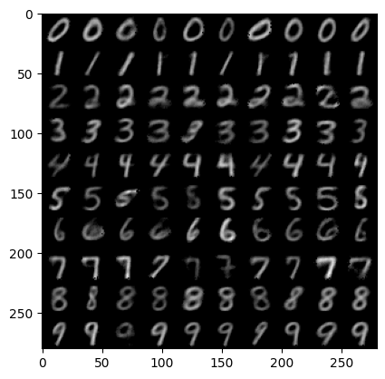

In my previous blog post, I discussed JAX - a framework for high performance
numerical computing and machine learning - in an atypical manner. **I didn't
create a single training loop**, and only showed a couple patterns that looked
vaguely machine learning-like. If you haven't read that blog post yet, you can
read it [here](https://afmck.in/posts/2023-05-22-jax-post/).

This approach was deliberate as I felt that JAX - although designed for machine
learning research - is more general-purpose than that. The steps to use it are
to define what you want to happen, wrap it in within `jax.jit`, let JAX trace
out your function into an intermediate graph representation, which is then
passed to XLA where it will be compiled and optimised. The result is a single,
heavily-optimised, binary blob, ready and waiting to receive your data. This
approach is a natural fit for many machine learning applications, as well as
other scientific computing tasks. Therefore, targeting machine learning only
didn't make sense. It is also ground that has already been extensively covered 
- I wanted to do a different take on introductory JAX.

In the previous post, I mentioned that it *is* possible to develop a full
machine learning training loop - models, optimisers and all - in pure JAX. This
is self-evident as JAX is general-purpose. It is a good exercise, but not a
strategy I like to employ. In this blog post I want to introduce two higher
level libraries built on top of JAX, that do a lot of the heavy lifting for us
when writing machine learning applications. These libraries are **Flax** and **Optax**.

To summarise the libraries:
- **JAX** - provides a **high-level neural network API** that lets the developer
  reason about the model in terms of components, like in PyTorch, rather than
  with JAX functions that take parameters as inputs.
- **Optax** - a library containing a vast array of model training utilities, such
  as **optimisers, loss functions, learning rate schedulers**, and more! Very
  batteries-included.

At the end of this post, we will have implemented and trained a very simple
**class-conditioned image generation model** called a **variational
autoencoder** (VAE) to generate MNIST digits.

## Neural Network API with Flax

The high level structure of a training loop in pure JAX, looks something like
this:
```python
dataset = ...   # initialise training dataset that we can iterate over
params = ...    # initialise trainable parameters of our model
epochs = ...

def model_forward(params, batch):
    ...         # perform a forward pass of our model on `batch` using `params`
    return outputs

def loss_fn(params, batch):
    model_output = model_forward(params, batch)
    loss = ...  # compute a loss based on `batch` and `model_output`
    return loss

@jax.jit
def train_step(params, batch):
    loss, grads = jax.value_and_grad(loss_fn)(params, batch)
    grads = ...  # transform `grads` (clipping, multiply by learning rate, etc.)
    params = ... # update `params` using `grads` (such as via SGD)
    return params, loss

for _ in range(epochs):
    for batch in dataset:
        params, loss = train_step(params, batch)
        ...         # report metrics like loss, accuracy, and the like.
```
We define our model in a functional manner: a function that takes the model
parameters and a batch as input, and returns the output of the model.
Similarly, we define the loss function that also takes the parameters and a
batch as input, but returns the loss instead.

Our final function is the train step itself which we wrap in `jax.jit` – giving
XLA maximum context to compile and optimise the training step. This first
computes the gradient of the loss function using the function transform
`jax.value_and_grad`, manipulates the returned gradients (perhaps scaling by a
learning rate), and updates the parameters. We return the new parameters, and
use them on the next call to `train_step`. This is called in a loop, fetching
new batches from the dataset before each training step.

Most machine learning programs follow a pattern such as the one above. But in
frameworks like PyTorch, we package together the model forward pass and the
management of model parameters into a stateful object representing our model –
simplifying the training loop. It would be nice if we could imitate this
behaviour in stateless JAX to allow the developer to reason about models in a
class-based way. This is what Flax's neural network API – `flax.linen` – aims
to achieve.

> Whether or not writing models in a purely stateless, functional way is better
than a stateful, class-based way, is not the topic of this blog post. Both have
merits. **Regardless, during execution the final result is the same whether we
use Flax or not. We get a stateless, heavily-optimised, binary blob that we
throw data at.** It's all JAX after all.

There are two main ways to define a module in Flax: one is PyTorch-like and
the other is a compact representation:
```python
import flax.linen as nn
from typing import Callable
class Model(nn.Module):
    dim: int
    activation_fn: Callable = nn.relu

    def setup(self):
        self.layer = nn.Dense(self.dim)

    def __call__(self, x):
        x = self.layer(x)
        return self.activation_fn(x)

class ModelCompact(nn.Module):
    dim: int
    activation_fn: Callable = nn.relu

    @nn.compact
    def __call__(self, x):
        x = nn.Dense(self.dim)(x)
        return self.activation_fn(x)     
```

If we have complex initialisation logic, the former may be more appropriate. If
the module is relatively simple, we can make use of the `nn.compact`
representation to automatically define the module by the forward pass alone.

Like other frameworks, we can nest modules within each other to implement
complex model behaviour. Like we've already seen, `flax.linen` provides some
pre-baked modules like `nn.Dense` (same as PyTorch's `nn.Linear`). I won't
enumerate them all, but the usual candidates are all there like convolutions,
embeddings, and more.

> Something to bear in mind if you are porting models from PyTorch to Flax is
that the default weight initialisation may be different. For example, in
PyTorch the default bias initialisation is the LeCun normal, but in Flax it is
initialised to zero.

However, currently we cannot call this model, even if we were to initialise the
class itself. There simply aren't any parameters to use. Furthermore, the
module is never a container for parameters. **An instance of a Flax module is
simply a hollow shell, that loosely associates operations with parameters and
inputs** that are passed as input later.

To see what I mean, let's initialise some parameters for our model:
```python
key = jax.random.PRNGKey(0xffff)
key, model_key = jax.random.split(key)

model = Model(dim=4)
params = model.init(model_key, jnp.zeros((1, 8)))
params
===
Out: 
FrozenDict({
    params: {
        layer: {
            kernel: Array([[-0.05412389, -0.28172645, -0.07438638,  0.5238516 ],
                   [-0.13562573, -0.17592733,  0.45305118, -0.0650041 ],
                   [ 0.25177842,  0.13981569, -0.41496065, -0.15681015],
                   [ 0.13783392, -0.6254694 , -0.09966562, -0.04283331],
                   [ 0.48194656,  0.07596914,  0.0429794 , -0.2127948 ],
                   [-0.6694777 ,  0.15849823, -0.4057232 ,  0.26767966],
                   [ 0.22948688,  0.00706845,  0.0145666 , -0.1280596 ],
                   [ 0.62309605,  0.12575962, -0.05112049, -0.316764  ]],      dtype=float32),
            bias: Array([0., 0., 0., 0.], dtype=float32),
        },
    },
})
```

In the above cell, we first initialised our model class, which returns an
instance of `Model` which we assign to the variable `model`. Like I said, it
does not contain any parameters, it is just a hollow shell that we pass
parameters and inputs to. We can see this by printing the `model` variable
itself:

```python
model
===
Out: Model(
    # attributes
    dim = 4
    activation_fn = relu
)
```

We can also call the module itself, which will fail even though we have defined
the `__call__` method:
```python
model(jnp.zeros((1, 8)))
===
Out:
/usr/local/lib/python3.10/dist-packages/flax/linen/module.py in __getattr__(self, name)
    935         msg += (f' If "{name}" is defined in \'.setup()\', remember these fields '
    936           'are only accessible from inside \'init\' or \'apply\'.')
--> 937       raise AttributeError(msg)
    938 
    939   def __dir__(self) -> List[str]:

AttributeError: "Model" object has no attribute "layer". If "layer" is defined in '.setup()', remember these fields are only accessible from inside 'init' or 'apply'.
```

To initialise the parameters, we passed a PRNG key and some dummy inputs to the
model's `init` function of the same shape and dtype as the inputs we will use
later. In this simple case, we just pass `x` as in the original module's
`__call__` definition, but could be multiple arrays, PyTrees, or PRNG keys. We
need the input shapes and dtypes in order to determine the shape and dtype of
the model parameters.

From the `model.init` call, we get a nested `FrozenDict` holding our model's
parameters. If you have seen PyTorch state dictionaries, the format of the
parameters is similar: nested dictionaries with meaningful named keys, with
parameter arrays as values. If you've read my previous blog post or read about
JAX before, you will know that this structure is a PyTree. Not only does Flax
help developers loosely associate parameters and operations, **it also helps
initialise model parameters based on the model definition**.

With the parameters, we can call the model using `model.apply` – providing the
parameters and inputs:
```python
key, x_key = jax.random.split(key)
x = jax.random.normal(x_key, (1, 8))
y = model.apply(params, x)
y
===
Out: Array([[0.9296505 , 0.25998798, 0.01101626, 0.        ]], dtype=float32)
```

There is nothing special about the PyTree returned by `model.init` – it is just
a regular PyTree storing the model's parameters. `params` can be swapped with
any other PyTree that contains the parameters `model` expects:
```python
zero_params = jax.tree_map(jnp.zeros_like, params) # generates a PyTree with same structure as `params` will all values set to 0.
print(zero_params)
model.apply(zero_params, x)
===
Out:
FrozenDict({
    params: {
        layer: {
            bias: Array([0., 0., 0., 0.], dtype=float32),
            kernel: Array([[0., 0., 0., 0.],
                   [0., 0., 0., 0.],
                   [0., 0., 0., 0.],
                   [0., 0., 0., 0.],
                   [0., 0., 0., 0.],
                   [0., 0., 0., 0.],
                   [0., 0., 0., 0.],
                   [0., 0., 0., 0.]], dtype=float32),
        },
    },
})

Array([[0., 0., 0., 0.]], dtype=float32)
```

Forcing model calls to require explicitly passing parameters keeps it
stateless and returning parameters like any other PyTree, makes Flax
interoperable with JAX functions – as well as other libraries built on JAX.
**Essentially, by using Flax we aren't forced to use any other specific
frameworks and have access to all regular JAX features.**

If you are used to frameworks like PyTorch, calling models like this feels
unnatural at first. However, I personally quite like it this way – it feels
rather elegant to pass different parameters to the model to get different
behaviour rather than "load" the weights. A bit subjective and fuzzy, I know,
but I like it.

> To summarise the difference, if we aim to implement $f_\theta(x)$, a PyTorch
module is basically $f_\theta$ (which we can call on $x$). A Flax module is
simply $f$, which needs to be provided parameters $\theta$ before it can be
called on $x$ – or alternatively, we call $f$ on $(\theta, x)$.

All in all, the point of Flax is to **provide a familiar stateful API for
development** whilst **preserving JAX statelessness during runtime**. We can
build our neural network modules in terms of classes and objects, but **the
final result is a stateless function `model.apply` that takes in our inputs and
a PyTree of parameters.**

This is identical behaviour to what we began with (recall our `model_forward`
function at the start of this section), just now tied up nicely together.
Therefore, our function containing `model.apply` that takes as input our
PyTree, can be safely jit-compiled. The result is the same, a heavily-optimised
binary blob we bombard with data. Nothing changes during runtime, it just makes
development easier for those who prefer reasoning about neural networks in a
class-based way whilst remaining interoperable with, and keeping the
performance of JAX.

There's a lot more to Flax than this, especially outside the `flax.linen`
neural network API. For now though, we will move on to developing a full
training loop using Flax and **Optax**. We will swing back around to some extra
Flax points later, but I feel some concepts are hard to explain without first
showing a training loop.

## A full training loop with Optax and Flax

We've shown how to reduce the complexity of writing model code and parameter
initialisation. We can push this further by relying on Optax to handle the
gradient manipulation and parameter updates in `train_step`. For simple
optimisers, these steps can be quite simple. However, for more complex
optimisers or gradient transformation behaviour, it can get quite complex to
implement in JAX alone. Optax packages this complex behaviour into a simple
API.

```python
import optax
optimiser = optax.sgd(learning_rate=1e-3)
optimiser
===
Out: GradientTransformationExtraArgs(init=<function chain.<locals>.init_fn at 0x7fa7185503a0>, update=<function chain.<locals>.update_fn at 0x7fa718550550>)
```

Not pretty, but we can see that the optimiser is just a **gradient
transformation** – in fact all optimisers in Optax are implemented as gradient
transformations. A gradient transformation is defined to be a pair of functions
`init` and `update`, which are both pure functions. Like a Flax model, Optax
optimisers have no state kept internally, and must be initialised before it can
be used, and any state must be passed by the developer to `update`:
```python
optimiser_state = optimiser.init(params)
optimiser_state
===
Out: (EmptyState(), EmptyState())
```

Of course, as SGD is a stateless optimiser, the initialisation call simply
returns an empty state. It must return this to maintain the API of a gradient
transformation. Let's try with a more complex optimiser like Adam:

```python
optimiser = optax.adam(learning_rate=1e-3)
optimiser_state = optimiser.init(params)
optimiser_state
===
Out: (ScaleByAdamState(count=Array(0, dtype=int32), mu=FrozenDict({
     params: {
         layer: {
             bias: Array([0., 0., 0., 0.], dtype=float32),
             kernel: Array([[0., 0., 0., 0.],
                    [0., 0., 0., 0.],
                    [0., 0., 0., 0.],
                    [0., 0., 0., 0.],
                    [0., 0., 0., 0.],
                    [0., 0., 0., 0.],
                    [0., 0., 0., 0.],
                    [0., 0., 0., 0.]], dtype=float32),
         },
     },
 }), nu=FrozenDict({
     params: {
         layer: {
             bias: Array([0., 0., 0., 0.], dtype=float32),
             kernel: Array([[0., 0., 0., 0.],
                    [0., 0., 0., 0.],
                    [0., 0., 0., 0.],
                    [0., 0., 0., 0.],
                    [0., 0., 0., 0.],
                    [0., 0., 0., 0.],
                    [0., 0., 0., 0.],
                    [0., 0., 0., 0.]], dtype=float32),
         },
     },
 })),
 EmptyState())
```
Here, we can see the first and second order statistics of the Adam optimiser,
as well as a count storing number of optimiser updates. Like with SGD, this
state needs to be passed to `update` when called.

> Like Flax parameters, the optimiser state is just a PyTree. Any
PyTree with a compatible structure could also be used. Again, this also allows
interoperability with JAX and `jax.jit`, as well as other libraries built on
top of JAX.

Concretely, **Optax gradient transformations are simply a named tuple
containing pure functions `init` and `update`**. `init` is a pure function which
takes in an example instance of gradients to be transformed and returns the
optimiser initial state. In the case of `optax.sgd` this returns an empty state
regardless of the example provided. For `optax.adam`, we get a more complex
state containing the first and second order statistics of the same PyTree
structure as the provided example.

`update` takes in a PyTree of updates with the same structure as the example
instance provided to `init`. In addition, it takes in the optimiser state
returned by `init` and optionally the parameters of the model itself, which may
be needed for some optimisers. This function will return the transformed
gradients (**which could be another set of gradients, or the actual parameter
updates**) and the new optimiser state.

> This is explained quite nicely in the documentation
[here](https://optax.readthedocs.io/en/latest/api.html?highlight=gradienttransform#optax-types)

In action on some dummy data, we get the following:
```python
import optax
params = jnp.array([0.0, 1.0, 2.0]) # some dummy parameters
optimiser = optax.adam(learning_rate=0.01)
opt_state = optimiser.init(params)

grads = jnp.array([4.0, 0.6, -3])# some dummy gradients
updates, opt_state = optimiser.update(grads, opt_state, params)
updates
===
Out: Array([-0.00999993, -0.00999993,  0.00999993], dtype=float32)
```

Optax provides a helper function to actually apply the updates to our
parameters:
```python
new_params = optax.apply_updates(params, updates)
new_params
===
Out: Array([-0.00999993,  0.99000007,  2.01      ], dtype=float32)
```

It is important to emphasise that Optax optimisers are gradient transformations,
**but gradient transformations are not just optimisers.** We'll see more of that
later after we finish the training loop.

On that note, let's begin with said training loop. Recall that our goal is to
train a class-conditioned, variational autoencoder (VAE) on the MNIST dataset.

> I chose this example as it is slightly more interesting than the typical
classification example found in most tutorials.

Not strictly related to JAX, Flax, or Optax, but it is worth describing what a
VAE is. First, an autoencoder model is one that maps some input $x$ in our data
space to a **latent vector** $z$ in the **latent space** (a space with smaller
dimensionality than the data space) and back to the data space. It is trained to
minimise the reconstruction loss between the input and the output, essentially
learning the identity function through an **information bottleneck**.

The portion of the network that maps from the data space to the latent space is
called the **encoder** and the portion that maps from the latent space to the
data space is called the **decoder**. Applying the encoder is somewhat
analogous to lossy compression. Likewise, *applying the decoder is akin to
lossy decompression.


What makes a VAE different to an autoencoder is that the encoder does not
output the latent vector directly. Instead, **it outputs the mean and
log-variance of a Gaussian distribution, which we then sample from in order
to obtain our latent vector**. We apply an extra loss term to make these mean and
log-variance outputs roughly follow the standard normal distribution. 

> Interestingly, defining the encoder this way means for every given input $x$
we have many possible latent vectors which are sampled stochastically. Our
encoder is almost mapping to a sphere of possible latents centred at the mean
vector with radius scaling with log-variance.

The decoder is the same as before. However, now we can sample **a latent from
the normal distribution and pass it to the decoder in order to generate samples
like those in the dataset**! Adding the variational component turns our
autoencoder compression model into a VAE generative model.

](img/vae-aws.jpg)
> Abstract diagram of a VAE, pilfered from [this AWS blog](https://aws.amazon.com/blogs/machine-learning/deploying-variational-autoencoders-for-anomaly-detection-with-tensorflow-serving-on-amazon-sagemaker/)

Our goal is to implement the model code for the VAE as well as the training loop
with both the reconstruction and variational loss terms. Then, we can sample new
digits that look like those in the MNIST dataset! Additionally, we will provide
an extra input to the model – the class index – so we can control which number
we want to generate.

Let's begin by defining our configuration. For this educational example, we will
just define some constants in a cell:
```python
batch_size = 16
latent_dim = 32
kl_weight = 0.5
num_classes = 10
seed = 0xffff
```

Along with some imports and PRNG initialisation:
```python
import jax # install correct wheel for accelerator you want to use
import flax
import optax
import orbax

import flax.linen as nn
import jax.numpy as jnp
import numpy as np
from jax.typing import ArrayLike

from typing import Tuple, Callable
from math import sqrt

import torchvision.transforms as T
from torchvision.datasets import MNIST
from torch.utils.data import DataLoader

key = jax.random.PRNGKey(seed)
```

Let's grab our MNIST dataset while we are here:
```python
train_dataset = MNIST('data', train = True, transform=T.ToTensor(), download=True)
train_loader = DataLoader(train_dataset, batch_size=batch_size, shuffle=True, drop_last=True)
```

> JAX, Flax, and Optax do not have data loading utilities, so I just use
the perfectly serviceable PyTorch implementation of the MNIST dataset here.

Now to our first real Flax model. We begin by defining a submodule `FeedForward`
that implements a stack of linear layers with intermediate non-linearities:

```python
class FeedForward(nn.Module):
  dimensions: Tuple[int] = (256, 128, 64)
  activation_fn: Callable = nn.relu
  drop_last_activation: bool = False

  @nn.compact
  def __call__(self, x: ArrayLike) -> ArrayLike:
    for i, d in enumerate(self.dimensions):
      x = nn.Dense(d)(x)  
      if i != len(self.dimensions) - 1 or not self.drop_last_activation:
        x = self.activation_fn(x)
    return x

key, model_key = jax.random.split(key)
model = FeedForward(dimensions = (4, 2, 1), drop_last_activation = True)
print(model)

params = model.init(model_key, jnp.zeros((1, 8)))
print(params)

key, x_key = jax.random.split(key)
x = jax.random.normal(x_key, (1, 8))
y = model.apply(params, x)

y
===
Out: 


FeedForward(
    # attributes
    dimensions = (4, 2, 1)
    activation_fn = relu
    drop_last_activation = True
)
FrozenDict({
    params: {
        Dense_0: {
            kernel: Array([[ 0.0840368 , -0.18825287,  0.49946404, -0.4610112 ],
                   [ 0.4370267 ,  0.21035315, -0.19604324,  0.39427406],
                   [ 0.00632685, -0.02732705,  0.16799504, -0.44181877],
                   [ 0.26044282,  0.42476758, -0.14758752, -0.29886967],
                   [-0.57811564, -0.18126923, -0.19411889, -0.10860331],
                   [-0.20605426, -0.16065307, -0.3016759 ,  0.44704655],
                   [ 0.35531637, -0.14256613,  0.13841921,  0.11269159],
                   [-0.430825  , -0.0171169 , -0.52949774,  0.4862139 ]],      dtype=float32),
            bias: Array([0., 0., 0., 0.], dtype=float32),
        },
        Dense_1: {
            kernel: Array([[ 0.03389561, -0.00805947],
                   [ 0.47362345,  0.37944487],
                   [ 0.41766328, -0.15580587],
                   [ 0.5538078 ,  0.18003668]], dtype=float32),
            bias: Array([0., 0.], dtype=float32),
        },
        Dense_2: {
            kernel: Array([[ 1.175035 ],
                   [-1.1607001]], dtype=float32),
            bias: Array([0.], dtype=float32),
        },
    },
})

Array([[0.5336972]], dtype=float32)
```
We use the `nn.compact` decorator here as the logic is relatively simple. We
iterate over the tuple `self.dimensions` and pass our current activations
through a `nn.Dense` module, followed by applying `self.activation_fn`. This
activation can optionally be dropped for the final linear layer in
`FeedForward`. This is needed as `nn.relu` only outputs non-negative values,
whereas sometimes we need non-negative outputs!

Using `FeedForward`, we can define our full VAE model:
```python
class VAE(nn.Module):
  encoder_dimensions: Tuple[int] = (256, 128, 64)
  decoder_dimensions: Tuple[int] = (128, 256, 784)
  latent_dim: int = 4
  activation_fn: Callable = nn.relu

  def setup(self):
    self.encoder = FeedForward(self.encoder_dimensions, self.activation_fn)
    self.pre_latent_proj = nn.Dense(self.latent_dim * 2)
    self.post_latent_proj = nn.Dense(self.encoder_dimensions[-1])
    self.class_proj = nn.Dense(self.encoder_dimensions[-1])
    self.decoder = FeedForward(self.decoder_dimensions, self.activation_fn, drop_last_activation=False)

  def reparam(self, mean: ArrayLike, logvar: ArrayLike, key: jax.random.PRNGKey) -> ArrayLike:
    std = jnp.exp(logvar * 0.5)
    eps = jax.random.normal(key, mean.shape)
    return eps * std + mean

  def encode(self, x: ArrayLike):
    x = self.encoder(x)
    mean, logvar = jnp.split(self.pre_latent_proj(x), 2, axis=-1)
    return mean, logvar

  def decode(self, x: ArrayLike, c: ArrayLike):
    x = self.post_latent_proj(x)
    x = x + self.class_proj(c)
    x = self.decoder(x)
    return x

  def __call__(
      self, x: ArrayLike, c: ArrayLike, key: jax.random.PRNGKey) -> Tuple[ArrayLike, ArrayLike, ArrayLike]:
    mean, logvar = self.encode(x)
    z = self.reparam(mean, logvar, key)
    y = self.decode(z, c)
    return y, mean, logvar

key = jax.random.PRNGKey(0x1234)
key, model_key = jax.random.split(key)
model = VAE(latent_dim=4)
print(model)

key, call_key = jax.random.split(key)
params = model.init(model_key, jnp.zeros((batch_size, 784)), jnp.zeros((batch_size, num_classes)), call_key)

recon, mean, logvar = model.apply(params, jnp.zeros((batch_size, 784)), jnp.zeros((batch_size, num_classes)), call_key)
recon.shape, mean.shape, logvar.shape
===
Out:
ClassVAE(
    # attributes
    encoder_dimensions = (256, 128, 64)
    decoder_dimensions = (128, 256, 784)
    latent_dim = 4
    activation_fn = relu
)
((16, 784), (16, 4), (16, 4))
```

There is a lot to the above cell. Knowing the specifics of how this model works
isn't too important to understanding the training loop later, as we can treat
the model as a bit of a black box. Simply substitute your own model of choice.
Saying that, I'll unpack each function briefly:
- `setup`: Creates the submodules of the network, namely two `FeedForward`
  stacks and two `nn.Linear` layers that project to and from the latent space.
  Additionally, it initialises a third `nn.Linear` layer that projects our
  class conditioning vector to the same dimensionality as the last encoder
  layer.
- `reparam`: Sampling a latent directly from a random Gaussian is not
  differentiable, hence we employ the **reparameterisation trick**. This
  involves sampling a random vector, scaling by the standard deviation, then
  adding to the mean. As it involves random array generation, we take as input
  a key in addition to the mean and log-variance.
- `encode`: Applies the encoder and projection to the latent space to the
  input. Note, the output of the projection is actually double the size of the
  latent space, as we split it in twine to obtain our mean and log-variance.
- `decode`: Applies a projection from the latent space to `x`, followed by
  adding the output of `class_proj` on the conditioning vector. Finally, it
  passes the result through the decoder stack.
- `__call__`: This is simply the full model forward pass: `encode` then
  `reparam` then `decode`. This is used during training.

The above example also demonstrates that we can add other functions to our Flax
modules aside from `setup` and `__call__`. This is useful for more complex
behaviour, or if we want to only execute parts of the model (more on this
later).

We now have our model, optimiser, and dataset. The next step is to write the
function that implements our training step and then jit-compile it:
```python
def create_train_step(key, model, optimiser):
  params = model.init(key, jnp.zeros((batch_size, 784)), jnp.zeros((batch_size, num_classes)), jax.random.PRNGKey(0)) # dummy key just as example input
  opt_state = optimiser.init(params)
  
  def loss_fn(params, x, c, key):
    reduce_dims = list(range(1, len(x.shape)))
    c = jax.nn.one_hot(c, num_classes) # one hot encode the class index
    recon, mean, logvar = model.apply(params, x, c, key)
    mse_loss = optax.l2_loss(recon, x).sum(axis=reduce_dims).mean()
    kl_loss = jnp.mean(-0.5 * jnp.sum(1 + logvar - mean ** 2 - jnp.exp(logvar), axis=reduce_dims)) # KL loss term to keep encoder output close to standard normal distribution.

    loss = mse_loss + kl_weight * kl_loss
    return loss, (mse_loss, kl_loss)

  @jax.jit
  def train_step(params, opt_state, x, c, key):
    losses, grads = jax.value_and_grad(loss_fn, has_aux=True)(params, x, c, key)
    loss, (mse_loss, kl_loss) = losses
    
    updates, opt_state = optimiser.update(grads, opt_state, params)
    params = optax.apply_updates(params, updates)

    return params, opt_state, loss, mse_loss, kl_loss

  return train_step, params, opt_state
```
Here, I don't define the training step directly, but rather first define a
function that returns the training step function given a target model and
optimiser, along with returning the freshly initialised parameters and
optimiser state.

Let us unpack it all:
1. First, it initialises our model using an example input. In this case, this
   is a 784-dim array which contains the (flattened) MNIST digit and a random,
   random key.
2. Also initialises the optimiser state using the parameters we just
   initialised.
3. Now, it defines the loss function. This is simply a `model.apply` call which
   returns the model's reconstruction of the input, along with the predicted
   mean and log-variance. We then compute the mean-squared error loss and the
   KL-divergence, before finally computing a weighted sum to get our final
   loss. The KL loss term is what keeps the encoder outputs close to a standard
   normal distribution.
4. Next, the actual train step definition. This begins by transforming
   `loss_fn` using our old friend `jax.value_and_grad` which will return the
   loss and also the gradients. We must set `has_aux=True` as we return all
   individual loss terms for logging purposes. We provide the gradients,
   optimiser state, and parameters to `optimiser.update` which returns the
   transformed gradients and the new optimiser state. The transformed gradients
   are then applied to the parameters. Finally, we return the new parameters,
   optimiser state, and loss terms – followed by wrapping the whole thing in
   `jax.jit`. Phew..

> A function that generates the training step is just a pattern I quite like,
and there is nothing stopping you from just writing the training step directly.

Let's call `create_train_step`:
```python
key, model_key = jax.random.split(key)

model = VAE(latent_dim=latent_dim)
optimiser = optax.adamw(learning_rate=1e-4)

train_step, params, opt_state = create_train_step(model_key, model, optimiser)
```

When we call the above, we get a `train_step` ready to be compiled and accept
our parameters, optimiser state, and data at blistering fast speeds. As always
with jit-compiled functions, the first call with a given set of input shapes
will be slow, but fast on subsequent calls as we skip the compiling and
optimisation process.

We are now in a position to write our training loop and train the model!
```python
freq = 100
for epoch in range(10):
  total_loss, total_mse, total_kl = 0.0, 0.0, 0.0
  for i, (batch, c) in enumerate(train_loader):
    key, subkey = jax.random.split(key)

    batch = batch.numpy().reshape(batch_size, 784)
    c = c.numpy()
    params, opt_state, loss, mse_loss, kl_loss = train_step(params, opt_state, batch, c, subkey)

    total_loss += loss
    total_mse += mse_loss
    total_kl += kl_loss

    if i > 0 and not i % freq:
      print(f"epoch {epoch} | step {i} | loss: {total_loss / freq} ~ mse: {total_mse / freq}. kl: {total_kl / freq}")
      total_loss = 0.
      total_mse, total_kl = 0.0, 0.0
===
Out:
epoch 0 | step 100 | loss: 49.439998626708984 ~ mse: 49.060447692871094. kl: 0.7591156363487244
epoch 0 | step 200 | loss: 37.1823616027832 ~ mse: 36.82903289794922. kl: 0.7066375613212585
epoch 0 | step 300 | loss: 33.82365036010742 ~ mse: 33.49456024169922. kl: 0.6581906080245972
epoch 0 | step 400 | loss: 31.904821395874023 ~ mse: 31.570871353149414. kl: 0.6679074764251709
epoch 0 | step 500 | loss: 31.095705032348633 ~ mse: 30.763246536254883. kl: 0.6649144887924194
epoch 0 | step 600 | loss: 29.771989822387695 ~ mse: 29.42426872253418. kl: 0.6954278349876404

...

epoch 9 | step 3100 | loss: 14.035745620727539 ~ mse: 10.833460807800293. kl: 6.404574871063232
epoch 9 | step 3200 | loss: 14.31241226196289 ~ mse: 11.043667793273926. kl: 6.53748893737793
epoch 9 | step 3300 | loss: 14.26440143585205 ~ mse: 11.01070785522461. kl: 6.5073771476745605
epoch 9 | step 3400 | loss: 13.96005630493164 ~ mse: 10.816412925720215. kl: 6.28728723526001
epoch 9 | step 3500 | loss: 14.166285514831543 ~ mse: 10.919700622558594. kl: 6.493169784545898
epoch 9 | step 3600 | loss: 13.819541931152344 ~ mse: 10.632755279541016. kl: 6.373570919036865
epoch 9 | step 3700 | loss: 14.452215194702148 ~ mse: 11.186063766479492. kl: 6.532294750213623
```
Now that we have our `train_step` function, the training loop itself is just
repeatedly fetching data, calling our uber-fast `train_step` function, and
logging results so we can track training. We can see that the loss is
decreasing, which means our model is training!

> Note that the KL-loss term *increases* during training. This is okay
so long as it doesn't get too high, in which case sampling from the model
becomes impossible. Tuning the hyperparameter `kl_weight` is quite important.
Too low and we get perfect reconstructions but no sampling capabilities – too
high and the outputs will become blurry.

Let's sample from the model so we can see that it does indeed produce some
reasonable samples:
```python
def build_sample_fn(model, params):
  @jax.jit
  def sample_fn(z: jnp.array, c: jnp.array) -> jnp.array:
    return model.apply(params, z, c, method=model.decode)
  return sample_fn

sample_fn = build_sample_fn(model, params)

num_samples = 100
h, w = 10

key, z_key = jax.random.split(key)
z = jax.random.normal(z_key, (num_samples, latent_dim))
c = np.repeat(np.arange(h)[:, np.newaxis], w, axis=-1).flatten()
c = jax.nn.one_hot(c, num_classes)
sample = sample_fn(z, c)
z.shape, c.shape, sample.shape
===
Out: ((100, 32), (100, 10), (100, 784))
```

The above cell generates 100 samples – 10 examples from each of the 10 classes.
We jit-compile our sample function in case we want to sample again later. We
only call the `model.decode` method, rather than the full model, as we only
need to decode our randomly sampled latents. This is achieved by specifying
`method=model.decode` in the `model.apply` call.

Let's visualise the results using matplotlib:
```python
import matplotlib.pyplot as plt
import math
from numpy import einsum

sample = einsum('ikjl', np.asarray(sample).reshape(h, w, 28, 28)).reshape(28*h, 28*w)

plt.imshow(sample, cmap='gray')
plt.show()
```


It seems our model did indeed train and can be sampled from! Additionally, the
model is capable of using the class conditioning signal so that we can control
which digits are generated. Therefore, we have succeeded in building a full
training loop using Flax and Optax!

## Extra Flax and Optax Tidbits

I'd like to finish this blog post by highlighting some interesting and useful
features that may prove useful in your own applications. I won't delve into
great detail but simply summarise and point you in the right direction.

You may have noticed already that when we add parameters, optimiser states, and
a bunch of other metrics to the return call of `train_step` it gets a bit
unwieldy to handle all the state. It could get worse if we later need a more
complex state. One solution would be to return a `namedtuple` so we can at
least package the state together somewhat. However, Flax provides its own
solution, `flax.training.train_state.TrainState`, which has some extra
functions that make updating the combined state (model and optimiser state)
easier.

It is easiest to show by simply taking our earlier `train_step` and refactoring
it with `TrainState`:
```python
from flax.training.train_state import TrainState
def create_train_step(key, model, optimiser):
  params = model.init(key, jnp.zeros((batch_size, 784)), jnp.zeros((batch_size, num_classes)), jax.random.PRNGKey(0))
  state = TrainState.create(apply_fn=model.apply, params=params, tx=optimiser)
  
  def loss_fn(state, x, c, key):
    reduce_dims = list(range(1, len(x.shape)))
    c = jax.nn.one_hot(c, num_classes)
    recon, mean, logvar = state.apply_fn(state.params, x, c, key)
    mse_loss = optax.l2_loss(recon, x).sum(axis=reduce_dims).mean()
    kl_loss = jnp.mean(-0.5 * jnp.sum(1 + logvar - mean ** 2 - jnp.exp(logvar), axis=reduce_dims))

    loss = mse_loss + kl_weight * kl_loss
    return loss, (mse_loss, kl_loss)

  @jax.jit
  def train_step(state, x, c, key):
    losses, grads = jax.value_and_grad(loss_fn, has_aux=True)(state, x, c, key)
    loss, (mse_loss, kl_loss) = losses

    state = state.apply_gradients(grads=grads)

    return state, loss, mse_loss, kl_loss

  return train_step, state
```

We begin `create_train_step` by initialising our parameters as before. However,
the next step is now to create the state using `TrainState.create` and passing
our model forward call, the initialised parameters, and the optimiser we want
to use. Internally, `TrainState.create` will initialise and store the optimiser
state for us.

In `loss_fn`, rather than call `model.apply` we can use `state.apply_fn`
instead. Either method is equivalent, just that sometimes we may not have
`model` in scope and so can't access `model.apply`.

The largest change is in `train_step` itself. Rather than call
`optimiser.update` followed by `optax.apply_updates`, we simply call
`state.apply_gradients` which internally updates the optimiser state and the
parameters. It then returns the new state, which we return and pass to the next
call of `train_step` – as we would with `params` and `opt_state`.

> It is possible to add extra attributes to `TrainState` by subclassing it, for
example adding attributes to store the latest loss.

In conclusion, `TrainState` makes it easier to pass around state in the training
loop, as well as abstracting away optimiser and parameter updates.

Another useful feature of Flax is the ability to *bind* parameters to a model,
yielding an interactive instance that can be called directly, as if it were a
PyTorch model with internal state. However, this state is static and can only
change if we bind it again, which makes it unusable for training. However, it
can be handy for interactive debugging or inference.

The API is pretty simple:
```python
key, model_key = jax.random.split(key)
model = nn.Dense(2)
params = model.init(model_key, jnp.zeros(8))

bound_model = model.bind(params)
bound_model(jnp.ones(8))
===
Out: Array([ 0.45935923, -0.691003  ], dtype=float32)
```

We can get back the unbound model and its parameters by calling `model.unbind`:
```python
bound_model.unbind()
===
Out: (Dense(
     # attributes
     features = 2
     use_bias = True
     dtype = None
     param_dtype = float32
     precision = None
     kernel_init = init
     bias_init = zeros
     dot_general = dot_general
 ),
 FrozenDict({
     params: {
         kernel: Array([[-0.11450272, -0.2808447 ],
                [-0.45104247, -0.3774913 ],
                [ 0.07462895,  0.3622056 ],
                [ 0.59189916, -0.34050766],
                [-0.10401642, -0.36226135],
                [ 0.157985  ,  0.00198693],
                [-0.00792678, -0.1142673 ],
                [ 0.31233454,  0.4201768 ]], dtype=float32),
         bias: Array([0., 0.], dtype=float32),
     },
 }))
```

I said I wouldn't enumerate layers in Flax as I don't see much value in doing
so, but I will highlight two particularly interesting ones. First is
`nn.Dropout` which is numerically the same as its PyTorch counterpart, but like
anything random in JAX, requires a PRNG key as input. 

The dropout layer takes its random key by internally calling
`self.make_rng('dropout')`, which pulls and splits from a PRNG stream named
`'dropout'`. This means when we call `model.apply` we will need to define the
starting key for this PRNG stream. This can be done by passing a dictionary
mapping stream names to PRNG keys, to the `rngs` argument in `model.apply`:
```python
key, x_key = jax.random.split(key)
key, drop_key = jax.random.split(key)
x = jax.random.normal(x_key, (3,3))

model = nn.Dropout(0.5, deterministic=False)
y = model.apply({}, x, rngs={'dropout': drop_key}) # there is no state, just pass empty dictionary :)
x, y
===
Out: (Array([[ 1.7353934, -1.741734 , -1.3312583],
        [-1.615281 , -0.6381292,  1.3057163],
        [ 1.2640097, -1.986926 ,  1.7818599]], dtype=float32),
 Array([[ 3.4707868,  0.       , -2.6625166],
        [ 0.       ,  0.       ,  2.6114326],
        [ 0.       , -3.973852 ,  0.       ]], dtype=float32))
```

> `model.init` also accepts a dictionary of PRNG keys. If you pass in a
single key like we have done so far, it starts a stream named `'params'`. This
is equivalent to passing `{'params': rng}` instead.

The streams are accessible to submodules, so `nn.Dropout` can call
`self.make_rng('dropout')` regardless of where it is in the model. We can
define our own PRNG streams by specifying them in the `model.apply` call. In
our VAE example, we could forgo passing in the key manually, and instead get
keys for random sampling using `self.make_rng('noise')` or similar, then
passing a starting key in `rngs` in `model.apply`. For models with lots of
randomness, it may be worth doing this.

The second useful built-in module is `nn.Sequential` which is again like its
PyTorch counterpart. This simply chains together many modules such that the
outputs of one module will flow into the inputs of the next. Useful if we want
to define large stacks of layers quickly.

Now onto some Optax tidbits! First, Optax comes with a bunch of learning rate
schedulers. Instead of passing a float value to `learning_rate` when creating
the optimiser, we can pass a scheduler. When applying updates, Optax will
automatically select the correct learning rate. Let's define a simple, linear
schedule:
```python
start_lr, end_lr = 1e-3, 1e-5
steps = 10_000
lr_scheduler = optax.linear_schedule(
  init_value=start_lr,
  end_value=end_lr,
  transition_steps=steps,
)
optimiser = optax.adam(learning_rate=lr_scheduler)
```

You can join together schedulers using `optax.join_schedules` in order to get
more complex behaviour like learning rate warmup followed by decay:
```python
warmup_start_lr, warmup_steps = 1e-6, 1000
start_lr, end_lr, steps = 1e-2, 1e-5, 10_000
lr_scheduler = optax.join_schedules(
    [
        optax.linear_schedule(
            warmup_start_lr,
            start_lr,
            warmup_steps,
        ),
        optax.linear_schedule(
            start_lr,
            end_lr,
            steps - warmup_steps,
        ),
    ],
    [warmup_steps],
)

optimiser = optax.adam(lr_scheduler)
```
The last argument to `optax.join_schedules` should be a sequence of integers
defining the step boundaries between different schedules. In this case, we
switch from warmup to decay after `warmup_steps` steps.

> Optax keeps track of the number of optimiser steps in its `opt_state`, so we
> don't need to track this ourselves.

Similar to joining schedulers, Optax supports chaining optimisers together.
More specifically, the chaining of gradient transformations:
```python
optimiser = optax.chain(
    optax.clip_by_global_norm(1.0),
    optax.adam(1e-2),
)
```

When calling `optimiser.update`, the gradients will first be clipped before
then doing the regular Adam update. Chaining together transformations like this
is quite an elegant API and allows for complex behaviour. To illustrate, adding
exponential moving averages (EMA) of our updates in something like PyTorch is
non-trivial, whereas in Optax it is as simple as adding `optax.ema` to our
`optax.chain` call:

```python
optimiser = optax.chain(
    optax.clip_by_global_norm(1.0),
    optax.adam(1e-2),
    optax.ema(decay=0.999)
)
```

In this case, `optax.ema` is a transformation on the final updates, rather than
on the unprocessed gradients.

Gradient accumulation is implemented in Optax as a optimiser wrapper, rather
than as a gradient transformation:

```python
grad_accum = 4
optimiser = optax.MultiSteps(optax.adam(1e-2), grad_accum)
```

The returned optimiser collects updates over the `optimiser.update` calls until
`grad_accum` steps have occurred. In the intermediate steps, the returned
updates will be a PyTree of zeros in the same shape as `params`, resulting in
no update. Every `grad_accum` steps, the accumulated updates will be returned.

`grad_accum` can also be a function, which gives us a way to vary the batch
size during training via adjusting the number of steps between parameter
updates.

How about if we only want to train certain parameters? For example, when
finetuning a pretrained model. Nowadays, this is a pretty common thing to do,
taking pretrained large language models and adapting them for specific
downstream tasks.

Let's grab a pretrained BERT model from the Huggingface hub:
```python
from transformers import FlaxBertForSequenceClassification
model = FlaxBertForSequenceClassification.from_pretrained('bert-base-uncased')
model.params.keys()
===
Out: dict_keys(['bert', 'classifier'])
```
> Huggingface provides Flax versions of *most* of their models. The API to use
them is a bit different, calling `model(**inputs, params=params)` rather than
`model.apply`. Providing no parameters will use the pretrained weights stored
in `model.params` which is useful for inference-only tasks, but for training we
need to pass the current parameters to the call.

We can see there are two top-level keys in the parameter PyTree: `bert` and
`classifier`. Suppose we only want to finetune the classifier head and leave the
BERT backbone alone, we can achieve this using `optax.multi_transform`:

```python
optimiser = optax.multi_transform({'train': optax.adam(1e-3), 'freeze': optax.set_to_zero()}, {'bert': 'freeze', 'classifier': 'train'})
opt_state = optimiser.init(model.params)

grads = jax.tree_map(jnp.ones_like, model.params)
updates, opt_state = optimiser.update(grads, opt_state, model.params)
```

`optax.multi_transform` takes two inputs, the first is mapping from labels to
gradient transformations. The second is a PyTree with the same structure or
prefix as the updates (in the case above we use the prefix approach) mapping to
labels. The transformation matching the label of a given update will be
applied. This allows the partitioning of parameters and applying different
updates to different parts.

> The second argument can also be a function that, given the updates PyTree,
returns such a PyTree mapping updates (or their prefix) to labels.

This can be used for other cases like having different optimisers for different
layers (such as disabling weight decay for certain layers), but in our case we
simply use `optax.adam` for our trainable parameters, and zero out gradients
for other regions using the stateless transform `optax.set_to_zero`.

> In jit-compiled function, the gradients that have `optax.set_to_zero` applied
> to them won't be computed due to the optimisation process seeing that they
> will always be zero. Hence, we get the expected memory savings from only
> finetuning a subset of layers!

Let's print the updates so that we can see that we do indeed have no updates in
the BERT backbone, and have updates in the classifier head:
```python
updates['classifier'], updates['bert']['embeddings']['token_type_embeddings']
===
Out:
{'bias': Array([-0.00100002, -0.00100002], dtype=float32),
 'kernel': Array([[-0.00100002, -0.00100002],
        [-0.00100002, -0.00100002],
        [-0.00100002, -0.00100002],
        ...,
        [-0.00100002, -0.00100002],
        [-0.00100002, -0.00100002],
        [-0.00100002, -0.00100002]], dtype=float32)}
{'embedding': Array([[0., 0., 0., ..., 0., 0., 0.],
        [0., 0., 0., ..., 0., 0., 0.]], dtype=float32)}
```

We can verify that all updates are zero using `jax.tree_util.tree_reduce`:
```python
jax.tree_util.tree_reduce(lambda c, p: c and (jnp.count_nonzero(p) == 0), updates['bert'], True)
===
Out: Array(True, dtype=bool)
```

Both Flax and Optax are quite feature-rich despite the relative infancy of the
JAX ecosystem. I'd recommend just opening the
[Flax](https://flax.readthedocs.io/en/latest/api_reference/index.html) or
[Optax API reference](https://optax.readthedocs.io/en/latest/api.html) and
searching for layers, optimisers, losses, and features you are used to having
in other frameworks.

The last thing I want to talk about involves an entirely different library build
on JAX. **Orbax** provides PyTree checkpointing utilities for saving and
restoring arbitrary PyTrees. I won't go into great detail but will show basic
usage here. There is nothing worse than spending hours training only to forget
about actually saving progress!

Here is basic usage saving the BERT classifier parameters:
```python
import orbax
import orbax.checkpoint
from flax.training import orbax_utils

orbax_checkpointer = orbax.checkpoint.PyTreeCheckpointer()
save_args = orbax_utils.save_args_from_target(model.params['classifier'])
orbax_checkpointer.save('classifier.ckpt', model.params['classifier'], save_args=save_args)
!ls
===
Out: classifier.ckpt
```

Which we can restore by executing:
```python
orbax_checkpointer.restore('classifier.ckpt')
===
Out: {'bias': array([0., 0.], dtype=float32),
 'kernel': array([[-0.06871808, -0.06338844],
        [-0.03397266,  0.00899913],
        [-0.00669084, -0.06431466],
        ...,
        [-0.02699363, -0.03812294],
        [-0.00148801,  0.01149782],
        [-0.01051403, -0.00801195]], dtype=float32)}
``` 
Which returns the raw PyTree. If you are using a custom dataclass with objects
that can't be serialised (such as a Flax train state where `apply_fn` and `tx`
can't be serialised) you can pass an example PyTree to `item` in the `restore`
call, to let Orbax know the structure you want.

Manually saving checkpoints like this is a bit old-fashioned. Orbax has a bunch
of automatic versioning and scheduling features built in, such as automatic
deleting of old checkpoints, tracking the best metric, and more. To use these
features, wrap the `orbax_checkpointer` in
`orbax.checkpoint.CheckpointManager`:

```python
options = orbax.checkpoint.CheckpointManagerOptions(max_to_keep=4, create=True)
checkpoint_manager = orbax.checkpoint.CheckpointManager(
    'managed-checkpoint', orbax_checkpointer, options)

for step in range(10):
    checkpoint_manager.save(step, model.params['classifier'], save_kwargs={'save_args': save_args})

!ls -l managed-checkpoint/*
===
Out:
managed-checkpoint/6:
total 4
drwxr-xr-x 2 root root 4096 Jun  3 09:07 default

managed-checkpoint/7:
total 4
drwxr-xr-x 2 root root 4096 Jun  3 09:07 default

managed-checkpoint/8:
total 4
drwxr-xr-x 2 root root 4096 Jun  3 09:07 default

managed-checkpoint/9:
total 4
drwxr-xr-x 2 root root 4096 Jun  3 09:07 default

```
As we set `max_to_keep=4`, only the last four checkpoints have been kept.

We can view which steps have checkpoints:
```python
checkpoint_manager.all_steps()
===
Out: [6, 7, 8, 9]
```

As well as view if there is a checkpoint for a specific step:
```python
checkpoint_manager.should_save(6)
===
Out: False
```

And what the latest saved step was:
```python
checkpoint_manager.latest_step()
===
Out: 9
```

We can restore using the checkpoint manager. Rather than provide a path to the
`restore` function, we provide the step we want to restore:
```python
step = checkpoint_manager.latest_step()
checkpoint_manager.restore(step)
===
Out: {'bias': array([0., 0.], dtype=float32),
 'kernel': array([[-0.06871808, -0.06338844],
        [-0.03397266,  0.00899913],
        [-0.00669084, -0.06431466],
        ...,
        [-0.02699363, -0.03812294],
        [-0.00148801,  0.01149782],
        [-0.01051403, -0.00801195]], dtype=float32)}
```

For especially large checkpoints, Orbax supports asynchronous checkpointing
which moves checkpointing to a background thread. You can do this by wrapping
`orbax.checkpoint.AsyncCheckpointer` around the
`orbax.checkpoint.PyTreeCheckpointer` we created earlier.

> You may see mention online to Flax checkpointing utilities. However, these
utilities are being deprecated and it is recommended to start using Orbax
instead.

The documentation for Orbax is a bit spartan, but it has a fair few options to
choose. It is worth just reading the `CheckpointManagerOptions` class
[here](https://github.com/google/orbax/blob/main/checkpoint/orbax/checkpoint/checkpoint_manager.py#L85)
and seeing the available features.

## Conclusion

In this blog post, I've introduced two libraries built on top of JAX: Flax and
Optax. This has been more of a practical guide into how you can implement
training loops easily in JAX using these libraries, rather than a ideological
discussion like my previous blog post on JAX.

To summarise this post:
- Flax provides a neural network API that allows the developer to build neural
  network modules in a class-based way. Unlike other frameworks, these modules
  do not contain state within them, essentially hollow shells that loosely
  associate functions with parameters and inputs, and provide easy methods to
  initialise the parameters.
- Optax provides a large suite of optimisers for updating our parameters.
  These, like Flax modules, do not contain state and must have state passed
  manually to it. All optimisers are simply gradient transformations: a
  pair of pure functions `init` and `update`. Optax also provides other
  gradient transformations and wrappers to allow for more complex behaviour,
  such as gradient clipping and parameter freezing.
- Both libraries simply operate on and return PyTrees and can easily
  interoperate with base JAX - crucially with `jax.jit`. This also makes them
  interoperable with other libraries based on JAX. For example, by choosing
  Flax, we aren't locked into using Optax, and vice versa.

There is a lot more to these two libraries than described here, but I hope this
is a good starting point and can enable you to create your own training loops
in JAX. A good exercise now would be to use the training loop and model code in
this blog post and adapting it for your own tasks, such as another generative
model.

If you liked this post please consider following me on
[Twitter](https://twitter.com/alexfmckinney) or use this site's RSS feed for
notifications on future ramblings about machine learning and other topics.
Alternatively you can navigate to the root of this website and repeatedly
refresh until something happens. Thank you for reading this far and I hope you
found it useful!

---

### Acknowledgements and Extra Resources
Some good extra resources:
- [My previous blog post on JAX](https://afmck.in/posts/2023-05-22-jax-post/)
- [Aleksa Gordic’s JAX and Flax tutorial series](https://github.com/gordicaleksa/get-started-with-JAX)
- [Flax documentation](https://flax.readthedocs.io/en/latest/)
- [Optax documentation](https://optax.readthedocs.io/en/latest/)
- [Equinox - another neural network library built on JAX by Patrick Kidger](https://github.com/patrick-kidger/equinox)
- [Haiku - another neural network library built on JAX from Deepmind](https://github.com/deepmind/dm-haiku)
- [Orbax source code](https://github.com/google/orbax)

*Found something wrong with this blog post? Let me know via email or Twitter!*
