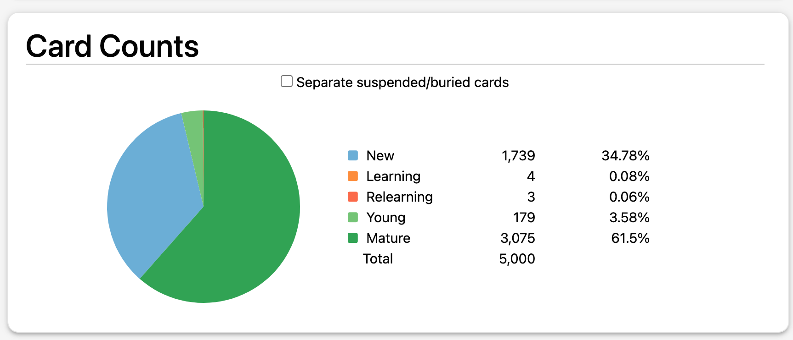
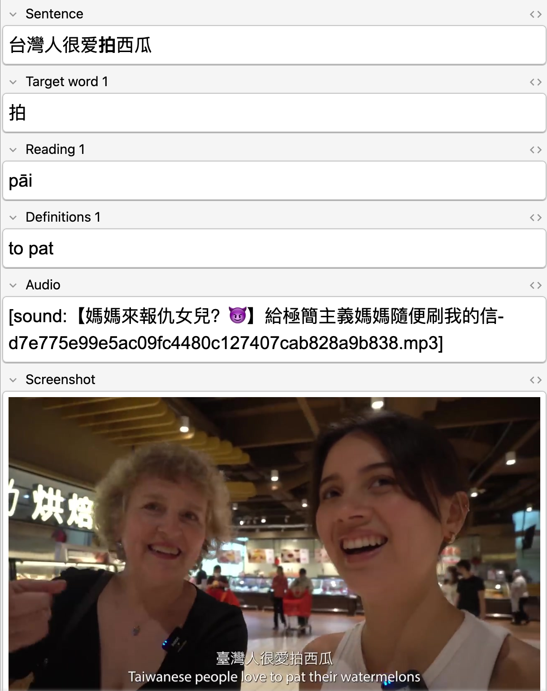
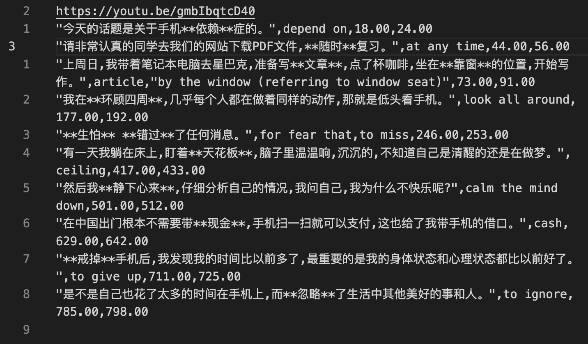
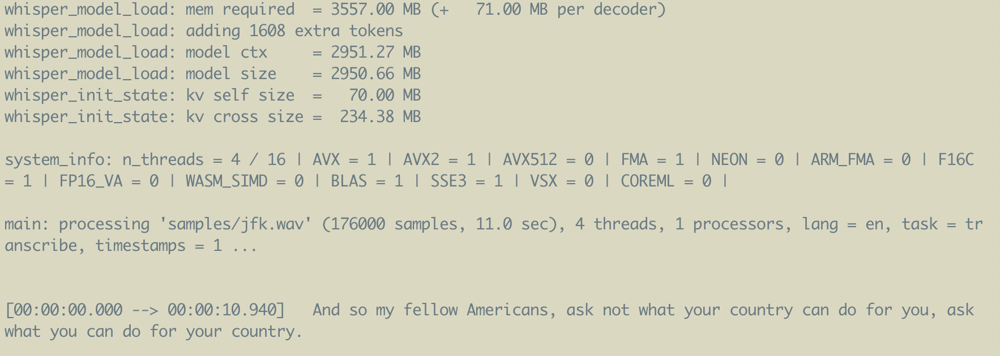

Online, I tend to market myself as an AI / computery guy, creating and following content related to these areas. However, I have other interests and passions to tinker with – unfortunately too many to actually dedicate lots of time to all of them with the exception of one. The One is language learning, specifically learning Chinese, which I am generally consistent with.

It has been a long road, starting in late 2018 but with large gaps and misguided routes taken along the way. Ultimately, in the past couple years I've been very consistent with vocabulary and reading practice. I've cracked the formula for learning in this regard, at least for me. By no means am I an expert, but on my trip to Taiwan I managed fine in the reading department – better than expected. Progressing here now is a matter of time rather than trying to hack my brain.

> Random rice field in Taiwan.

However, with listening I was much worse than expected. There were a handful of times I could fully understand what had been said. Most of the time I got the jist (smiling or laughing at opportune times) but not quick enough to timely reply. Contrary to popular belief, reading is a lot easier than listening.

Of course, this is also simply a function of time and effort put into listening practice. I have spent over a hundred times more time reading than listening, so naturally I am worse. Time spent on a skill over a long period of time mostly depends on how consistent you are at practising said skill. How consistent I am comes down to how frictionless it is to get started practising the skill.

> Some Statistics from a pre-made deck I use to learn new vocabulary passively.

> An example vocabulary card from a pre-made deck, which I use to acquire new vocabulary passively.

For reading, I use apps such as Anki and get little bits of practice in spare minutes here or there. It is easy to do this every day. Moreover, I have built a sufficient vocabulary base where I can read interesting content for fun, which also helps to stay consistent. Bar a handful of days, I have done cuecards every day for the past year. Listening, however, is more labor intensive to get started. To get better, I need to find a method that makes it easy for lazy-ol' me to be consistent with it.

## Ways of practising listening

Since beginning this journey nearly five years ago, I've explored and discarded a bunch of methods for both reading and listening. A big part of language learning is finding a method that works well for you. Perhaps a bit of a cope, but when you see on Youtube "I learnt X fluently in Y weeks", the same method may or may not work for you. Your goals may be different: levels of fluency, whether you care about writing and reading, or just speaking and listening, types of content, and so on. It is highly personal and takes much trial and error.

I'm happy to say for reading and vocabulary acquisition, I've found my method. For listening, I am still exploring. Some methods that I have and have not tried include:
- **Textbooks with audio** – These are good when getting started, but are not realistic examples and the content is often not very engaging.
- **Podcasts** – Good but the interesting content is too high level whilst the lower level stuff is less interesting, which equates to being harder to do every day.
- **Immersion** – This requires a higher level to do consistently, but would result in amazing gains able. 
- **Shadowing** – Listening to sentences and repeating them back to train ear and tongue in tandem. Very repetitive and boring.
- **Courses** – Courses like Pimsleur. Probably effective, but expensive and can't tailor the content to stuff I care about, making it boring.
- **Get a tutor** – This is great and relatively inexpensive. However, I wouldn't be able to do this every single day. Do in tandem with other methods.
- **Literally talk to strangers** – There are lots of Youtube polyglots who do a fair bit of this. To be honest the prospect terrifies me, but respect to them. The classic example is Laoshu (Mouse) but there is a recent trend for people like Ryan Hales to practice on apps like Omegle and OmeTv. This also requires a bit of bravery.
- **Sentence Mining** – Watching content with native subtitles and finding "$n+i$" sentences (sentences where you understand all but $i$ words – typically $i=1$), creating cuecards from them with audio. These are later reviewed using spaced repetition systems.

Sentence mining is my current method. As it uses subtitles, you can use any reading capabilities to support listening. Furthermore, you can tailor it exactly to your interests by picking content you like. For example, before going to Taiwan I watched videos by Taiwanese Youtubers. Now as I am about to move in with my girlfriend, I am watching cooking channels so I can learn the terminology so we can cook together in her language. Out of all the methods I have tried this is the method I enjoy the most. I think it _could_ become my end-game method.

> The first ard I made through sentence mining, which I created manually. From the show "Mom! Don't do that!"

I gave sentence mining a shot half a year ago after seeing amazing progress using sentence mining for learning Japanese by my favourite Youtube channel [Livakivi](https://www.youtube.com/c/livakivi). He has been documenting his process of learning Japanese **every day** for over four years, creating 20 new cuecards every day using sentence mining, recently reaching 20,000 cards total. The results are amazing, especially his fluency when speaking despite only practising speaking for a total of a few hours over four years.

> This is the reason I tend not to practice speaking, except random phrases for fun. It seems that speaking skills can follow directly from strong listening abilities.

Despite sentence mining being a promising approach, it is also very labor-intensive. For each sentence you want to mine, you need to:
- Write the full sentence in Anki.
- Highlight the target words.
- Write the readings (how to pronounce) of the target words. 
- Write the definitions of the target words.
- Record the sentence audio using audio capture tools.
- Optionally, take a screenshot of the content.

> Storing the readings is important in Chinese as the characters don't always give hints on how they are pronounced. It is also a tonal language, so I need to pay attention to tones in the words.

This is a lot. Without using tools you can easily spend more time creating cards than watching and concentrating on the content and the language. Livakivi, in his videos, uses [Migaku](https://www.migaku.io/) to automate some of the process. Before that, he used an array of tools to make mining somewhat easier, but states that without Migaku he would have likely burnt out long before reaching 20,000 cards.

> See [his video](https://youtu.be/QBcQJESGQvc) for more details on his process for sentence mining Japanese content. There are lots of parallels between learning Japanese and learning Chinese, so could learn a lot from his content despite targeting different languages.

I don't have the god-like levels of discipline of Livakivi to create 20 cards a day manually, like I started out doing, and soon enough I stopped entirely. But like I mentioned, after returning from Taiwan I felt disappointed by my listening abilities and endeavoured to re-approach the problem.

Like I said, to put in the time to get better I need to be consistent. In order to be consistent study needs to be frictionless. It can never be as easy as reviewing vocabulary cards, but I can try to make it as smooth as possible. And what better way than using ✨programming✨.

## The Things I Did

My goal was to write a program to make sentence mining from videos as easy as possible. I focused primarily on Youtube videos, but the same principles apply to local videos acquired through 🏴‍☠️legitimate means🏴‍☠️. The requirements were as follows:
- **Converts to Anki** so I can review on all devices, especially mobile. Also helps keep consistent by hooking into my existing Anki addiction (habit stacking).
- **Reduce labor cost** of creating cuecards so I can focus on the content I am mining and the language.
- Program needs to be **portable**. I travel frequently, so it should work on my Mac with a weak CPU, as well as on powerful desktops. Mobile would be cool, but not for now.
- **Robust**, nothing kills the mood more than tracebacks.

Contradicting the last point a bit, I decided to make it an exercise in quickly creating a hacky solution, then gradually iterating on it. I wasn't sure which ideas would work so I wanted to avoid prematurely overengineering a solution, only to hate using it.

### Iteration 1 – Basic MVP

The first iteration was basic. I began creating a script that takes a CSV file with the following fields:
- A sentence with Markdown bold tags highlighting target words.
- Definitions for each of the target words.
- Floating point values for the start and end times of the sentence in the content.

> Example CSV file. The first line is the target Youtube video URL, and all others are extracted sentences.

This script then generates readings all the target words using the Python library `pinyin`. Then, it uses `youtube-dl` to download the video and uses `ffmpeg` to extract audio and screenshots from the target regions. These are then formatted as another CSV file that is importable into Anki.

Although basic, this is easier than using screen capture tools to manually create audio recordings and screenshots. I am still, however, bottlenecked by copying or writing the sentences, and extracting precise, sub-second timestamps.

### Iteration 2 – Enter Whisper

Iteration 2 sought to iron out the task of creating the sentences and the timestamps. I stayed on brand and used ✨AI✨ to transcribe audio for me. Using `youtube-dl` to download the audio, I passed it to [Whisper JAX](https://github.com/sanchit-gandhi/whisper-jax) and parsed the output into a CSV file in the same format as the one I created by hand in Iteration 1 – just with an empty definitions field. 

Now all I need to do is highlight the target words and write their definition; Whisper handles the transcription and timestamps for me. If a particular sentence is too easy or too hard, I can just delete the sentence line. Highlighting and deleting like this is a breeze using Vim.

There remain some issues with this approach. For one, I found the timestamps were not granular enough, usually just to the second. Secondly, sometimes these timesteps were simply inaccurate or had glitchy repeated sentences. Finally, although on GPU it ran blazing fast, it was a slow on my laptop CPU.

### Iteration 3 – Whisper but slower

The current iteration instead uses [whisper.cpp](https://github.com/sanchit-gandhi/whisper-jax) – a zero dependency, optimised for CPU Whisper implementation, with limited CUDA support to boot. This makes it more useable on laptop at the cost of slower desktop performance. In practice this doesn't matter as I can simply do something else as the script runs. Furthermore, I've found the timestamps and transcriptions to be more accurate than the JAX implementation so far.

> Example transcript from `whisper.cpp` with timestamps on a short excerpt from JFK's famous speech.

The cherry on top was installing a command line version of Google Translate `trans`. It is great for quickly checking the meaning of words by switching terminal focus, rather than using my phone dictionary. Google Translate is unreliable for long or nuanced sentences, but not bad for single words. If you, dear reader, know of a command line English-Chinese dictionary please let me know.

## Limitations

The solution now is far better than manual work, but still not perfect. Remaining limitations include:
- Targets Youtube exclusively but could be extended to local videos. However, it cannot handle DRM-enabled content like on Netflix. Solution? 🏴‍️ 🤷
- Some videos _just don't work_ with Whisper. For example [Xiaoying Cuisine](https://www.youtube.com/@XiaoYingFood), a cooking channel, has many videos that Whisper just fails to transcribe, simply failing to print most the sentences. This happens with both implementations I tried, so it perhaps is an issue with the model itself.
- Cannot stream in videos, so longer content takes a while to process. Streaming is possible, but not necessary as I can start the script and do something else while it processes. I could also chunk up the video and transcribe each chunk at a time.
- Transcriptions are not 100% accurate, especially with certain accents. I wouldn't recommend this method unless you are advanced enough to spot errors. This slows things down as I cannot fully trust Whisper, but overall it is very accurate and faster than manual transcription.
- Cannot use on mobile. This would be cool, but I know little about mobile development.

The next step is to refactor the script now that I have a good proof of concept. It is currently an awful amalgamation of Python, binaries, and bash scripts. I would not add automatic definition generation. Chinese is a highly contextual, so often the meaning of words changes depending on context – on top of the nuance and ambiguity in all languages. As always, YMMV.

## Conclusion

Although I've defined a somewhat overkill method, I am quite lazy, so I know I need to proactively reduce friction in order to actually do things. This is somewhat contradictory, but it is what it is.

After using it for the past week, it is definitely helping with my consistency. Not only is there less friction, it also feels good to use a tool you yourself made. Additionally, writing about this and my goals publicly provides some soft peer pressure which should also help remain consistent. We'll see how that actually goes with time.

In general with computers, I feel it is nearly always worth the time to optimise your workflow in order to minimise the work required wherever possible. That is why I am so into using Linux for personal computing, but that is for another blog post entirely. This is just one example of this ideology.

Language learning itself is a topic I could talk at length about, but that is for another blog post. I actually have a draft on this that I wrote before going to Taiwan, however it was so long that I couldn't finish in time before leaving. This made a lot of the content totally out of date and hence is confined to a dead branch. Some day though.

<!-- TODO: random handwriting stuff -->

I had a few goals when writing this blog post. One, to show a cool use of AI for language learning. Two, to hopefully inspire people to identify and reduce friction in their own workflows. Finally, to practice writing short(er) form content.

If you liked this post please consider following me on [Twitter](https://twitter.com/alexfmckinney) or use this site's RSS feed for notifications on future ramblings. Alternatively you can navigate to the root of this website and repeatedly refresh until something happens. Thank you for reading this far and I hope you found it useful!

---

### Acknowledgements and Extra Resources

I take heavy inspiration from [Livakivi's Youtube Channel](https://www.youtube.com/@Livakivi). I would recommend checking it out even if you aren't interested in language learning. They cover many other topics like home renovation, drawing, technology, and just generally learning things. His full series on language learning can be found [here](https://www.youtube.com/playlist?list=PLYLTtm-WITnklOP-i4NClO1qA2qTkLC7z).

*Found something wrong with this blog post? Let me know via email or Twitter!*