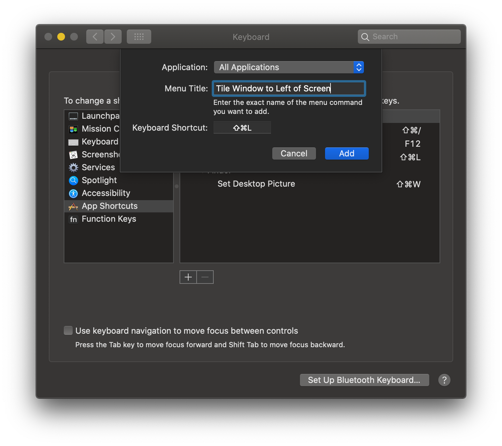
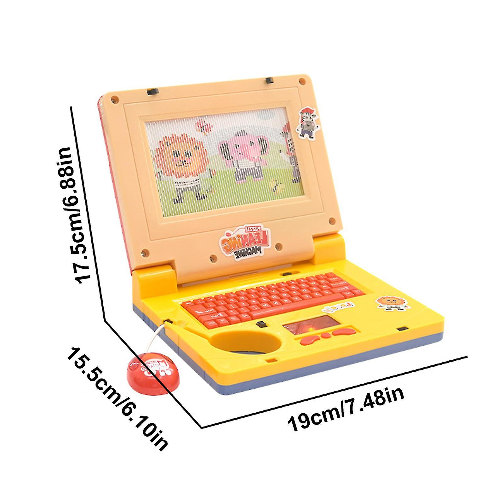

### Introduction

A few weeks ago I was made redundant along with a decent chunk of the company, after just under two months being employed there. Thanks to some odd technicalities, I was able to buy back my work laptop for a very low price. This was an M2 Air which ordinarily I would never use unless I had to, mostly due to the locked down nature of Mac that makes it difficult to customise exactly to my tastes, and also a dislike of the software it ships with.

However, the price made it too tempting to resist, along with really falling in love with the insane battery life and GPU power it could provide. So following a series of unfortunate events, it was an easy decision.

But if you have ever spoken to me before, you will know I am quite passionate about tailoring computers to my needs and preferences. This is why I daily drive Linux on my own machine as it gives me full control to streamline all my computer-related processes. If I can't do this, it genuinely contributes to low, underlying stress that begins to aggravate and strain me after continued usage.

Why it annoys me boils down to two key points:
- I will likely spend the majority of my life using a computer, be for work or leisure. Therefore, tiny annoyances and inefficiencies accumulate over time and are worth addressing.
- I get easily distracted, so I need to nuke distractions from my computer if I wish to get deep work done.

The first point is less about *time saving* and more about *cognitive load* - essentially how much thinking power does it take to get from A to B. For example, I want to open my code editor, a terminal, and a browser in a specific arrangement. On a fresh system, without knowing many keybinds, this devolves into many steps that require thought, such as finding where your programs are, launching them, rearranging windows to your liking, and such. This has introduced additional cognitive effort into what was initially a simple desire, which contributes (at least for me) to small levels of stress and distraction.

Perhaps you can't relate on this example, but here are a few others:
- Someone has taken all your files, flattened the directories, and pasted them all onto your desktop. Find that assignment that is due tomorrow!
- Keeping track of document versions via file names rather than version control software.
- Keyboard layout has changed between your PCs.
- Waiting for an annoying window animation to complete.
- Repeatedly testing code that requires multiple steps to reset the state (like deleting directories, resetting environment, etc.)
- All your nice cozy keybinds got reset and prod is down 🥹

> This concept of reducing the amount of thinking effort to do things on a computer is why I really like vim keybindings. Once you get good at it, you simply have to think "I want to delete that line / sentence / paragraph" and it happens in one step (`dd`, `d)`, `d}`) rather than thinking about intermediate steps like cursor navigation, and such. However, vim is not the point of this post.

The second point is more relatable. We already have an endless bombardment of distraction from our phones, scientifically designed to own your attention, (I don't think I need to elaborate here) so I try hard to make my computers a safe haven. So when my Mac starts telling me about the weather, world news, stock market, the time in Cupertino, or some random notification, I want to gouge out my own eyes.


> me when

Notifications from things I care about are worse as they are guaranteed to pull me out of whatever I am doing. These are easy to disable though, however simply *having the capability* to check things like Twitter, messenger, and Youtube is enough to sometimes pull me away from work - essentially checking to *see what I get* in much the same way you would pull from a slot machine.

Rant aside, I now possess a device that must use the famously locked down MacOS. Without the restriction of conforming to IT policy on what I can and can't do, can I make Mac as comfy to use as my main Linux daily driver? Spoilers, not really, but still an enjoyable computing experience.

### Tiling Window Management
My biggest issue with Mac out of the box is its window management. By default, there are no hotkeys for tiling and moving windows about the screen or for sending windows to different spaces.

Some of these can be enabled, some by checkbox and others by literally *typing in long strings to setup keyboard binds* (you have to type the full name of the command, like "Move Window to Left Side of Screen" when creating a keybind - talk about ergonomic). I find there are loads of technicalities to get something working without installing additional software, but it is pretty terrible for a modern OS to not have a lot of these by default.


> in this screenshot, words of deranged and lost.

> MacOS not having a lot of sensible defaults and apps is a common theme in this blog. For example, it doesn't even have per-app volume control, something I find insane to not have in the year of our lord 2023.

To actually get a decent window management experience, you need to rely on third party tools. In the past, I have tried two free solutions [Rectangle](https://rectangleapp.com/) (more of a window snapping tool than full window management) and [Amethyst](https://github.com/ianyh/Amethyst). Both are reasonable options, but by far the most feature complete (also free) solution is [Yabai](https://github.com/koekeishiya/yabai).

> Payed options also exist, which I have not tried out of principle.

Yabai exposes a bunch of commands that allows for control of windows, spaces, and displays from the command line. It also functions as a tiling window management (as opposed to floating) by automatically modifying window layout using binary space partitioning. Finally, it exposes extra settings for things like disabling animations, window shadows, and mouse control.

> If you aren't familiar with tiling versus floating window managers, the main difference is that tiling window managers will place and resize windows for you, whereas in floating window managers this is up to you. How exactly the windows are arranged in tiling window managers, and the degree of control you have, depends on the implementation and selected layout. Typically though, tiling window managers will not overlap windows, but do have the option for some windows to remain floating (such as popup boxes).

> Tiling window managers are not for everyone, but I consider them essential for me. This is due to my philosophy of reducing cognitive load when using computers, and spending time rearranging windows contributes to that. It is also particularly useful if you want to stop using a mouse as often. YMMV.

The biggest downside is that for some of its features, it requires the partial disabling of MacOS's System Integrity Protection (SIP). On work devices this could be unacceptable, which is why I had not tried Yabai until now. SIP basically just restricts the root user and where it can perform actions, so if you are comfortable working as root on Linux, and understand the risks of a truly unrestricted root user, then feel free to disable too.

`TODO: gif of opening terminals and seeing the automatic terminal resizing and repositioning`

I won't repeat how to install it as [the document](https://github.com/koekeishiya/yabai/wiki#quickstart-guide) is pretty good, but I will list out my configuration with comments for reference.
```
# this injects additional code into the dock process.
# will require SIP to be disabled and for permission to execute `yabai --load-sa` using sudo without a password.
yabai -m signal --add event=dock_did_restart action="sudo yabai --load-sa"
sudo yabai --load-sa

yabai -m config \
	# enables tiling window management
	layout bsp \

	# enable mouse dragging of windows when fn is held down
	mouse_modifier fn \

	# only enable shadows for floating windows
	window_shadow float \

	# make sure the mouse doesn't intefere with focus at all
	mouse_follows_focus off \
	focus_follows_mouse off \

	# disable animations for window movement
	window_animation_duration 0.0 \
	window_animation_frame_rate 120 \

	# setting window opacity (I like a bit of transparency..)
	window_opacity_duration 0.0 \
	active_window_opacity 1.0 \
	normal_window_opacity 0.9 \

	# default ratio to split windows by
	split_ratio 0.5 \
	split_type auto \
	
	# if enabled, split ratio is automatically determined.
	auto_balance off \

	# set padding between windows, purely for aesthetics.
	top_padding 5 \
	bottom_padding 5 \
	left_padding 5 \
	right_padding 5 \
	window_gap 5

# yabai used to support coloured borders for highlighted windows.
# However, this no longer works, so I use "JankyBorders" and 
# background it here.
borders active_color=0xffffffff inactive_color=0x00000000 width=2.0 2>/dev/null 1>&2 &
```

The last line enables borders so I can identify the currently focused window, using a program named [JankyBorders](https://github.com/FelixKratz/JankyBorders) - useful when working with many windows at once.

> Yabai used to have inbuilt support for borders, which you may see referenced online. However, it has since removed them so the relevant configuration options won't be recognised.

Yabai supports hot-reloading of the config file, so changes to the config will be made in real-time. This is useful for tweaking settings until you get something that feels good for you.

With this config alone, there is no way to actually control windows beyond dragging them while holding the `fn` key. The magic begins to happen when we combine this with the hotkey daemon skhd.

### Hotkeys
[skhd](https://github.com/koekeishiya/skhd) defines key bindings via a simple text file config. Like Yabai, it supports hot-reloading of the config, so we can quickly iterate on configuration changes.

Again, I won't enumerate the installation instructions. Luckily they don't require disabling SIP, so are accessible to a wider range of users. Below is the configuration I use:

```
# switch space using Ctrl and Number keys
ctrl - 1 : yabai -m space --focus 1
ctrl - 2 : yabai -m space --focus 2
ctrl - 3 : yabai -m space --focus 3
ctrl - 4 : yabai -m space --focus 4
ctrl - 5 : yabai -m space --focus 5
ctrl - 6 : yabai -m space --focus 6
ctrl - 7 : yabai -m space --focus 7
ctrl - 8 : yabai -m space --focus 8
ctrl - 9 : yabai -m space --focus 9

# send focused window to space using Ctrl, Shift and Number keys
shift + ctrl - 1 : yabai -m window --space 1
shift + ctrl - 2 : yabai -m window --space 2
shift + ctrl - 3 : yabai -m window --space 3
shift + ctrl - 4 : yabai -m window --space 4
shift + ctrl - 5 : yabai -m window --space 5
shift + ctrl - 6 : yabai -m window --space 6
shift + ctrl - 7 : yabai -m window --space 7
shift + ctrl - 8 : yabai -m window --space 8
shift + ctrl - 9 : yabai -m window --space 9

# swap window position with Ctrl, Shift and J/K
shift + ctrl - j : ~/.config/yabai/swap_clockwise.sh
shift + ctrl - k : ~/.config/yabai/swap_anticlockwise.sh

# cycle window focus with Ctrl and J/K
ctrl - j : ~/.config/yabai/cycle_clockwise.sh
ctrl - k : ~/.config/yabai/cycle_anticlockwise.sh

# opening some common applications
# keeping this sleek for now, but will add more as I find it necessary
shift + ctrl - return : open -n -a "iterm"
shift + ctrl - c : open -n -a "Firefox"

# resizing windows with Ctrl, Option and HJKL
ctrl + alt - h : yabai -m window --resize left:-30:0 ; yabai -m window --resize right:-30:0
ctrl + alt - j : yabai -m window --resize bottom:0:30 ; yabai -m window --resize top:0:30
ctrl + alt - k : yabai -m window --resize top:0:-30 ; yabai -m window --resize bottom:0:-30
ctrl + alt - l : yabai -m window --resize right:30:0 ; yabai -m window --resize left:30:0

# toggle floating and place in centre with Ctrl and Space
ctrl - space : yabai -m window --toggle float; yabai -m window --grid 5:5:1:1:3:3

```

Here, we can see the real use case for Yabai: its ability to send commands to manipulate window position.

On the left side of the colon is the skhd keybind, and on the right side is the command to execute. Usually, the command is to use yabai to manipulate the windows, such as focusing a particular space, moving a window, or resizing window. But it can execute anything, for example I bind `Ctrl + Shift + C` to open Firefox.

`TODO: gif of opening firefox and terminal with keybinds, then swapping, cycling, resizing`

I kept program launching binds to a minimum for now, but will likely add more later. I tend to find that the inbuilt Mac spotlight feature (with modifications) is a pretty good program launcher.

Most of these commands are self-explanatory. You can find a full list of available commands [in the Yabai wiki](https://github.com/koekeishiya/yabai/wiki/Commands#message-passing-interface). However, the commands to cycle and swap window position call a custom script, which requires unpacking.

To "cycle clockwise" means to move focus clockwise on the screen. I much prefer this to having to remember keybinds for focus in actual directions, as I will usually have at most 3 windows on screen at a time. This means that "this way or that way" is sufficient. Here is the script:
```
# get the id of the current focused window
win=$(yabai -m query --windows --window | jq '.id')

# get the id of the "last" window in the list
last_win=$(yabai -m query --windows --window last | jq '.id')

# focus the next window or cycle to the first, if the current window is the last.
if [[ $win == $last_win ]]; then
	yabai -m window --focus first
else
	yabai -m window --focus next
fi
```

To "swap clockwise" is similar: swapping the focused window and the next window in a clockwise fashion:
```
win=$(yabai -m query --windows --window last | jq '.id')

while : ; do
    yabai -m window $win --swap prev &> /dev/null
    if [[ $? -eq 1 ]]; then
        break
    fi
done
```
This works by iteratively swapping all windows on the screen.

All in all, this yabai configuration is pretty barebones, but it is working for me for now. If you want to see more complex setups, I would advise visiting [the UnixPorn subreddit](https://old.reddit.com/r/unixporn) (😳) and searching for Yabai.

### Optimising Terminal Use
I like the terminal, and I do most of my work within it. The default MacOS terminal experience is pretty good, which is one reason I think developers tend to prefer it over Windows. However, it can be improved with additional tweaks.

Most of these are not MacOS specific and could be applied to terminals on any operating system. However, the ones I mention here are motivated by specific issues I had with the default MacOS experience.

First up is the much-loved [brew](https://brew.sh/) which I am forever surprised is not just packaged with MacOS nowadays. This is essentially a package manager that you can use to install pretty much every program you can think of from the terminal.

This is to solve the issue of either going to the app store to get applications (which requires billing information even for free apps) or sourcing applications from the internet *and literally dragging the icon to the applications folder to install.* Could not be closer to baby's first computer if you tried.


Another classic that most developers know is [iTerm2](https://iterm2.com/), basically a must have for anyone using the terminal on MacOS. You can see the full list of features [here](https://iterm2.com/features.html) with my favourite being Copy Mode and inline images.

MacOS uses zsh as the shell in use by the user. Whenever I use zsh, I always install [oh-my-zsh](https://ohmyz.sh/) which is a community driven, batteries-included framework around zsh. With it, you get access to hundreds of themes and plugins to enhance the terminal experience.

I keep my list of plugins minimal to limit the effect on startup time. These include git integration (displays branch and other git-related info), sudo (double tap escape to execute the last command but with sudo), and fzf (Ctrl+T to launch a fuzzy file finder).

`TODO: screenshot of git`

fzf is particularly useful as I really dislike the default file explorer Finder in MacOS, finding it to be slow and bloated. I have even had it lock up my system before with very large directories. You also can't remove it as Finder is also responsible for other GUI elements in MacOS, such as the desktop. fzf is a good substitute for quickly directory hopping.

`TODO: gif of fzf`

In a similar vein, an underutilised feature of zsh is the `cdr` command, which is basically a quick way to return to recently visited directories. This can be enabled with the following additions to your `.zshrc` file:
```
autoload -Uz chpwd_recent_dirs cdr add-zsh-hook
add-zsh-hook chpwd chpwd_recent_dirs
zstyle ':completion:*:*:cdr:*:*' menu selection
```

Once enabled, type `cdr ` followed by pressing tab to display a list of recent directories. Tab through these and press enter to select and change to that directory.

`TODO: cdr`

Finally, I deleted a lot of the directories within the home directory that get auto-generated by MacOS. I find these to be useless and clutter up space. Sadly, some of these will keep regenerating even if you delete them (Desktop) or will be regenerated after opening programs you cannot delete (iTunes creates the Music folder).

### Miscellaneous Stuff
This final section shares a few random changes you may find useful:
- I hate docks, but sadly it cannot be removed! Like Finder, the Dock is responsible for more than just the dock. The second best thing you can do is make it very tiny and changing it to a position you are unlikely to hit. For me, this was to the left. The best you can do is run the following script to set the dock delay, making it less likely for you to mouse over it for long enough to trigger it:
```
defaults write com.apple.dock autohide-delay -float <time in seconds>; killall Dock
```
`TODO: gif of the dock`
- I unchecked all options in Spotlight except for System Settings, Calculator, and Applications. This makes Spotlight function like a very good program launcher, without any other things polluting the search results.
- Deleted all the widgets and turned off all notifications. Annoyingly, there is no way to do this globally, so you need to go through all one by one and turn them off.
- Modern versions of MacOS don't have a way to set the wallpaper for all spaces in one go. You need to do it one-by-one, or delete all spaces, change the wallpaper, and recreate the spaces. The following command will set the background on all spaces to any image you want:
```
 sqlite3 ~/Library/Application\ Support/Dock/desktoppicture.db "update data set value = '/path/to/any/picture.png'";
 killall Dock;
```
- Installed [BackgroundMusic](https://github.com/kyleneideck/BackgroundMusic) to provide per-app volume control. Then uninstalled it as it was buggy for me. YMMV.
- Disabled as much telemetry as I could, basically by following [this guide](https://github.com/herrbischoff/telemetry)
- Disabling trackpad gestures as I don't need them now with Yabai and skhd. I just accidentally trigger them rather than using them intentionally.

### Conclusion

Though the changes I made are minimal, the effect of my workflow has been pretty immense. There are still some rough spots - some I can change and others I can't. But overall MacOS is much more useable for me, and is now actually comfortable to use when away from my main workstation.

I find the default experience, in contrast, extremely painful to use. I genuinely cannot understand how so many people are able to tolerate this. I am writing this mainly for others who find using these devices difficult and stressful, particularly those coming from Linux backgrounds. However, if you are perfectly happy with MacOS, I hope you discovered some useful tips here you can apply to your workflow, and that we agree that optimising your processes around computers is very important.

Of course, it isn't like that a lot of Linux distros are perfect out of the box either. Some just land you into a bare virtual terminal which isn't exactly the bastion of usability. However the crucial difference is in the ease of customisation and how you are *encouraged* to customise, rather than meeting roadblocks at each turn.

_If you liked this post please consider following me on [Twitter](https://twitter.com/alexfmckinney) or use this site’s RSS feed for notifications on future ramblings. Alternatively you can navigate to the root of this website and repeatedly refresh until something happens. Thank you for reading this far and I hope you found it useful!_
