I've been learning about machine learning on-and-off since about 2017. I first became interested in the field after stumbling across [Andrej Karpathy's classic blog, The Unreasonable Effectiveness of Recurrent Neural Networks](http://karpathy.github.io/2015/05/21/rnn-effectiveness/). How exactly I came across it is lost to time, however I remember being struck with how impressive (at the time) the outputs were – doubly so as my programming experience then was limited. The idea of programs capable of *generating things* was eye-opening.

This led me down the deep learning rabbit hole, spending a lot of time trying to understand what the hell these things were. I didn't have a computer-literate mentor, and less of an accessible hobbyist community back then, so this was a solo endeavour. I distinctly remember training my first network, literally deep in the snowy Scottish Highlands, written from scratch in *Visual Basic.NET*, to emulate an XOR gate. With that, the die was cast and I was hooked.

During my deep dive, I found some examples of generating music using recurrent neural networks, the most memorable to me being [this video by Carykh](https://youtu.be/SacogDL_4JU?si=9bT_yuyljVtWsQp1). This combined my two great interests at the time, so I decided to emulate the results myself from scratch as my final-year project in high school.

This attempt was horribly naive as I was still a beginner programmer. I had no notion of things like using third party libraries, of multiprocessing or hardware acceleration, or pretty much any niceties. Everything was done from scratch, down to matrices implemented as linked lists of lists of lists, to matrix multiplications as single-threaded, nested for loops, all the way to higher order optimisers.

The result was the first version of **TchAIkovsky** – named after Tchaikovsky. This never produced anything remotely resembling music, most likely being too slow to converge. Hilariously, part of the project required having an *end user*, to which I selected my music teacher. Asking a veteran musician to evaluate the musicality of literal random noise is challenging. I curse my past self for losing the source code for this project, as it no doubt would be fantastic to read. I did manage to track down a few screenshots though.

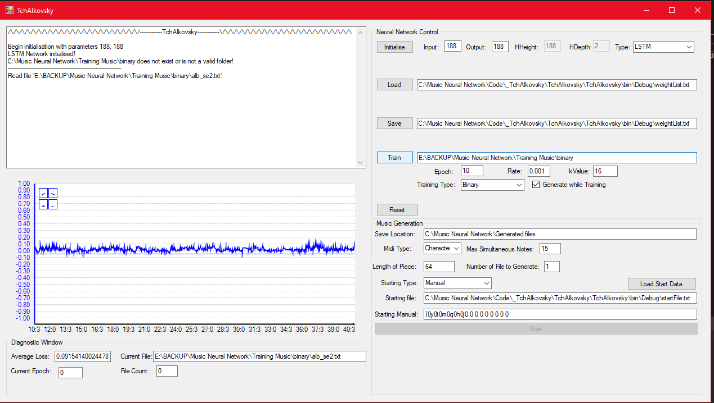

> Snazzy UI though

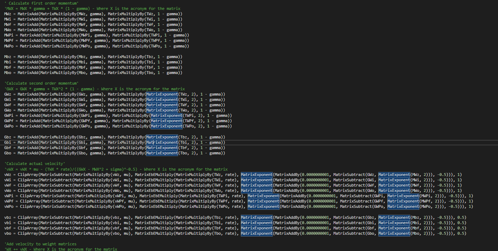

> Excellent and highly extensible code.

Though I got a good grade, the lack of a satisfactory solution meant this idea of generating music using AI persisted in my head for years to come. As I gained more experience, I occasionally revisited the topic, but not investing enough time to yield results. However, recently I got made redundant (interesting job offers welcome) and consequently acquired time and a knocked ego. I thought a small project close to heart would perk me up, and so I revisited this problem, six years later, equipped with much more experience. This is the result of such work.

I apologise for the lengthy introduction, but as this is something close to heart and the origin of my career thus far, it felt wrong to share this project without providing full context.

The rest of this blog post will be a technical dive into generating music as **MIDI** using **Transformers** implemented with **JAX** and **Equinox**. I will assume basic knowledge of transformer architectures and JAX, though if you are unfamiliar with these you should still be able to get the jist of this blog. If you would like further technical details on these topics, see [the Annotated Transformer]() and my two blog posts on JAX [here]() and [here]().

### What is MIDI?
If you imagine how audio is represented on a computer, you will likely think of a waveform:

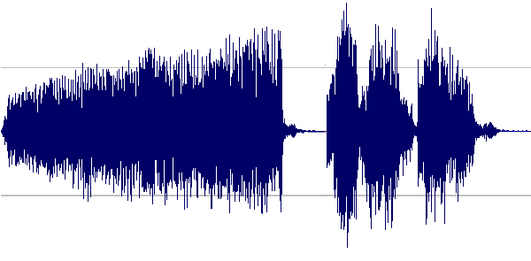

Which is pretty much, indeed, how raw audio is represented on a computer, as an array of samples.

The dimensionality (simply, size) of raw audio is immense. Generally speaking, any data with a temporal element sampled at a high frequency will have a large dimensionality. This does not *gel well* with the high compute requirements of neural networks, especially those *certain architectures* with an $O(n^2)$ space complexity with sequence length.

Imagine your favourite piece of music. If the quality is good and it is relatively modern, it was probably sampled at around 44.1kHz – or 44,100 samples per second. For a three minute piece of music that is 7,938,000 samples in the whole file. Throw in a second channel of audio (stereo) and you get 15,876,000. Compare and contrast with text sequences with thousands of tokens, and images with a couple million pixels at most. Naively plugging in the full sequence into a transformer with its memory-hungry attention layers simply is not possible.

There are a number of strategies to deal with this, such as limiting the size of the context window, using a lower sampling rate, sampling in a latent space, and so on. However, if we are simply interested in modelling *music* and not *audio*, we actually don't have to model waveforms directly.

One format for specifically representing music is called MIDI (Musical Instrument Digital Interface). Rather, this is a standard interface between digital musical instruments (such as a keyboard) and computers, such that different digital instruments and tools can interface with each other, and computers, in the same way – rather than having different standards for different manufacturers. It can also be used for recording playbacks of performances, composing music on a computer using a Digital Audio Workstation (DAW), or for storing music on memory constrained devices (such as old consoles).

Simplifying things, MIDI is simply a set of instructions for how digital instruments should be played. A MIDI file is then simply a list of instructions from this set. It cannot be played and listened to directly, but can be interpreted and rendered as audio by providing it with a *sound-font* containing the sound of each instrument we want to use at different pitches and velocities (volumes).

Instructions include, but are not limited to:
- Note On and Note Off events.
- Sustain on and off
- Pitch bends
- Volume
- Start and end of different "MIDI programs"
- Metadata such as comments

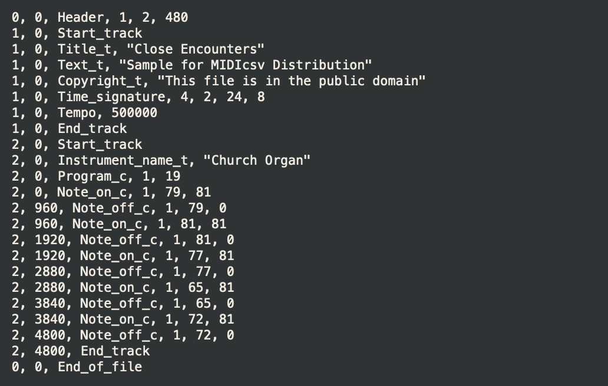
> Example visualisation of MIDI instructions using the [midicsv](https://www.fourmilab.ch/webtools/midicsv/) program

This reduces the complexity of our music generation problem significantly. For one, we have a more limited set of instructions that can be present in the data, rather than the relative large space of values a single sample can take in a waveform. Two, rather than generating the actual sound of a particular note (say, the sound of a single key being pressed on a piano) or the combination of multiple notes, the model just needs to generate a few tokens to achieve the same effect. Not only is this easier to model (temporal dependancies over a much shorter distance) but is also less computationally expensive.

A MIDI file is closer to natural language inputs traditionally given to transformers. Just imagine individual MIDI instructions like the individual characters in an NLP training dataset.

Of course, before passing text to a transformer, we usually want to tokenize into a more compact representation than simply character-by character. The same is true for MIDI data, but it is less apparent how this should be done, and what the effect will be on the final outputs.
### Tokenising MIDI data
Transformers are great in the sense that they seem to work with any modality, provided you first tokenise the raw data in some way. I was watching a good talk by Lucas Beyer on this recently on Aleksa Gordić's discord server that said as much: 
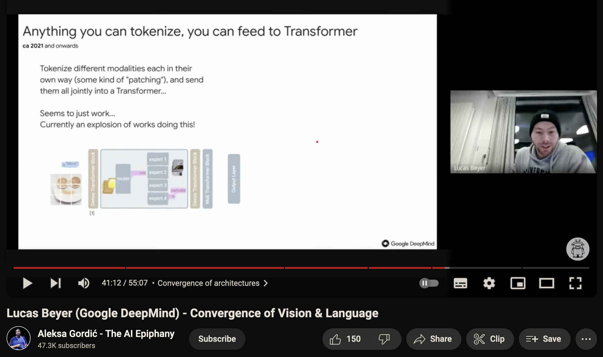

> This is very cool, but also a little bit uncool if you look back at all the interesting modality-specific architectures that were commonplace just a few years back. For now, attention is indeed all you need.

The difficulty of this depends on the modality. Luckily for us, MIDI makes sense to interpret in a purely sequential manner, which simplifies things somewhat. In addition, it has a known and fixed instruction set, which translates to a limited vocabulary size. If we wanted to, we could basically create a vocabulary of all possible MIDI instructions and events and train our model based on that. Like I alluded to earlier, this is similar to training a character-level NLP model.

> Arguably, MIDI can be interpreted a multi-dimensional input if it contains *multiple programs*. For example, multiple instruments or parts playing simultaneously. However, we can equally interpret this as the *concatenation* of programs, returning to a sequential perspective. For this project, I focused on piano solo performances with both left and right hands merged into a single program, so a sequential perspective holds here.

Though modelling the full MIDI instruction set is possible, it doesn't really make sense to do so.

For one, we may not require the full MIDI note range, which runs from 0 to 127. For context, a grand piano only covers from 21 to 108. We may also not need all features (like pitch bend) or are only interested in single program files. It could also be more efficient to encode groups of notes that commonly occur together (such as chords) as a single token, rather than explicitly predicting all notes. Finally, modelling the full MIDI specification is a more complex task, and may mandate a larger model than we are willing to train.

In practice, we select a subset of features that we care about. This choice will affect the quality of the downstream generations.

When I first attempted this in 2017, I went for the "piano roll" approach. This is like modelling music like one of those automatically playing pianos, or a music box.

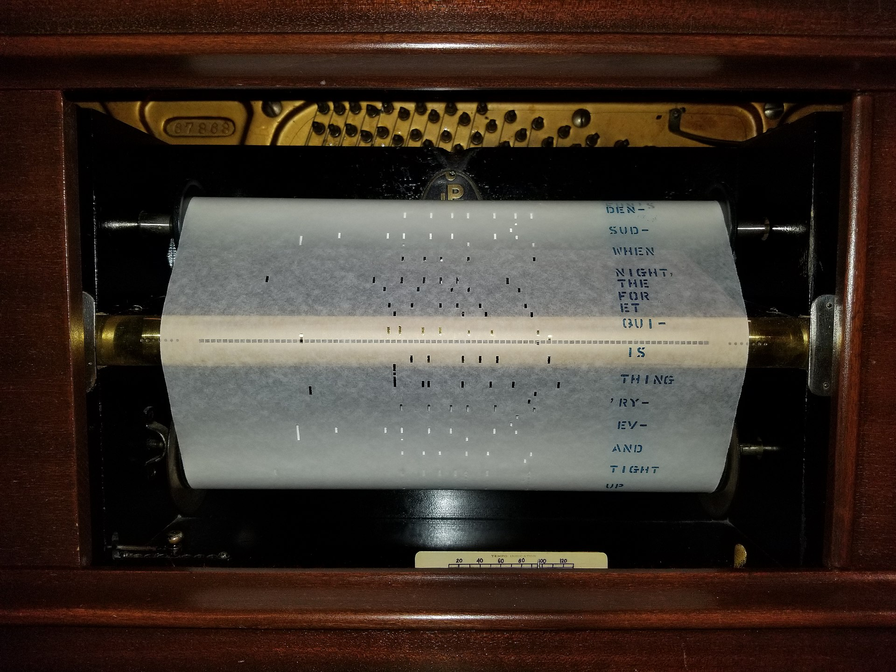
> Old-timey piano roll for use in an automatic piano.

The idea is that each column encodes a single note in our chosen note range. Each row is a discrete time step. A highlighted region indicates the note should be pressed and naturally nothing indicates that the note should not be pressed. With this, we can encode when a note is either on or off, but not much else.

In a computer, we can achieve a similar thing by discretising the MIDI file along the time axis and encoding a 1 for when a particular note is on, and 0 otherwise.
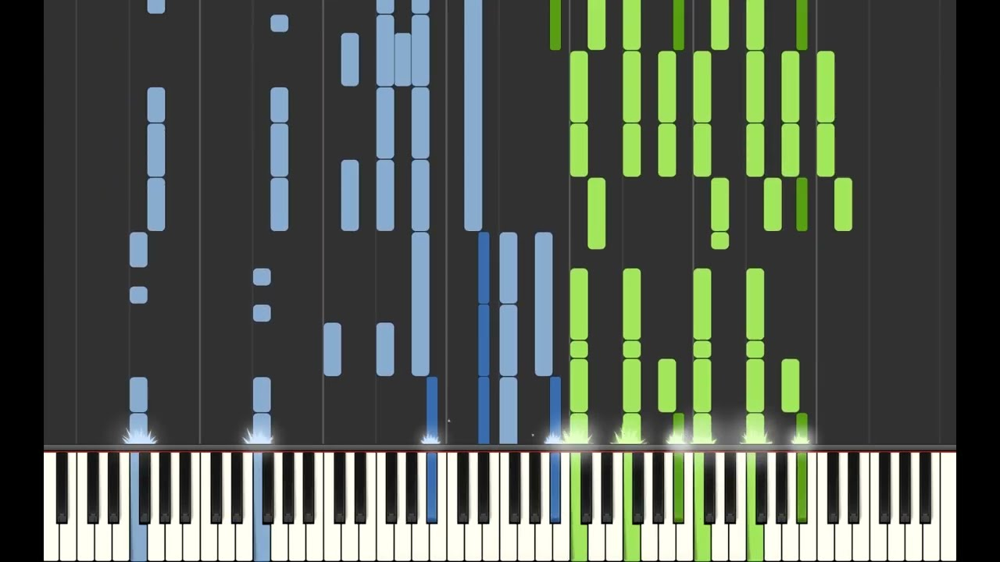
> Synthesia visualisation of notorious anime OP "Unravel"

This has the advantage of modelling full polyphony – where we can have many notes playing at the same time – and having a known amount of tokens per second in the raw file. This is because we have to pick some fixed time step size to discretise our file, and hence know the amount of tokens used for each unit of time.

> I am not sure if this approach can be considered tokenisation in the traditional sense. There are $2^N$ possible note on and off combinations (where $N$ is the number of values in the selected range), which is our "vocabulary size". However, we model this as predicting $N$ token sets independently, each with a vocabulary size of $2$. The combination of all these predictions forms one "token".

However, this fixed time step size is also a huge weakness. As we have a fixed sampling frequency, certain patterns in the source MIDI may not be represented accurately in our tokenised version – fast passages, notes that don't land exactly on the beat, changes in tempo, or performances that include dramatic pauses are also examples of patterns that may not be encoded correctly. This is particularly a problem for MIDI files recorded from a real human performance.

Secondly, this only encodes whether a note is pressed or not, and misses a lot of other information such as the velocity (volume) of a note, sustain pedal events (a note might be *off* but still makes sound due to the sustain pedal being depressed), and so on.

Finally, this approach requires the model predicting *all notes* in a given timestep at the same time, which is difficult to model. A slightly better approach is to predict note on and note off events sequentially, and add a special *advance time* token to "move" to the next discrete time step. This results in longer sequence lengths but is easier to model. This also results in ambiguity in how to order tokens in the same MIDI timestep, as any permutation of events decodes to the same MIDI, but is interpreted by the model differently.

Luckily, since my original attempt, other people have proposed better ways of tokenising MIDI than "what I thought of in my head". So for this project, I decided to employ a more sophisticated tokenisation scheme, based on the paper Pop Music Transformer from Taiwan AI Labs.

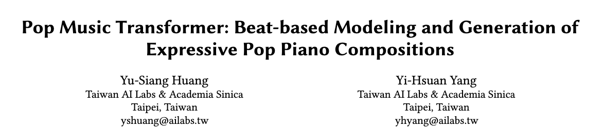
> I feel doing research in MIDI generation must be a pretty sweet deal.

Their tokenisation strategy (or at least my understanding of it), named REMI, encodes MIDI files using the following tokens:
- Note On events ranging from 0 to 127.
- Immediately prior a Note On event, a Velocity token containing the volume of the note to be played.
- Immediately after a Note On event, the Duration of a note measured from 1-64 in increments of 32th note multiples.
- Bar token to indicate the start of a new bar and Position tokens with 16 discrete bins to indicate the current position within a bar.
- Tempo tokens to indicate changes in tempo (how long a note actually is in real time). This is always followed by a Position event. Tempo is represented by a combination of a Tempo class (low, medium, or high) and a Tempo value within the selected Tempo class.
- Chord token with 60 possible values. Interestingly, they still add note on events following the chord token, meaning this is simply a marker to help the model. This is always immediately followed by a position event.
> Some music terminology was used above. Here are some simplified explanations:
> - A Bar (or Measure) is a unit of time, containing a number of beats defined by the *Time signature*.
> - The length in real time of a beat is defined by the tempo, usually measured in beats per minute.
> - A chord is a harmonic set of notes played simultaneously (or close to simultaneously), usually three of more notes.

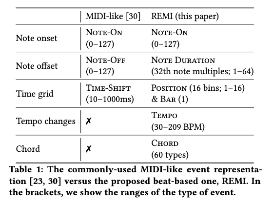
> Summary from the Pop Transformer paper on their tokenisation strategy REMI versus "standard" MIDI tokenisation.

The use of Duration tokens rather than Note Off events helps to avoid predicting "dangling Note On events", where the model generates Note On events but no matching Note Off events, which would result in notes being held forever.

> There is the risk the model doesn't generate a Duration token, however this is low as they always immediately follow a Note On event, meaning it is easy for the model to understand the relationship between adjacent Note On and Duration tokens, versus potentially distance Note On and Note Off tokens.

The Bar and Position tokens are to help the model understand that music has a grid structure to it, as well as how note duration (measured in increments of a full note) relates to the current position in a bar. Although the grid structure of music can be learnt by a model without these tokens, without them it can result in the generated music *drifting* from a grid like structure for longer generations.

Tempo tokens allows us to adjust how much real time is represented by one step of Position. This gives our discrete grid a controllable sampling frequency, allowing to represent a range of speeds accurately.

Similar to Bar and Position, it is possible for a model to understand chords without explicit tokens for them, but it is still helpful to include information about it. They encode all possible note roots for the chord (from A to G) and five chord qualities (major, minor, diminished, augmented, dominant) which yields 60 possible Chord tokens. This also explains why we can't simply decode Chord tokens into MIDI, as we do not include information about *which octave the chord is played in*. So, it simply serves as a marker and the model still needs to predict the actual notes.

It is interesting to note that only Note On, Duration, and Tempo are actually used when decoding the tokenised sequence back to MIDI. The rest are just "helper tokens" for the model to use. It is a pretty cool idea to include tokens purely for helping model understanding and would be a nice idea to explore in other modalities.

> For example, in autoregressive image models (does anyone use these anymore?) inserting `ROW_END` tokens.

With all that, we have a pretty expressive tokenisation scheme that accurately tokenises MIDI files with all the features we want, namely the ability to handle a range of tempos, different volumes, full polyphony, and more. Rather than implement this myself, I relied on the [miditok](https://github.com/Natooz/MidiTok) library which already includes the REMI tokeniser.

On top of the REMI tokeniser, I trained a Byte-Pair Encoding (BPE) tokeniser. This will group together commonly occurring token sequences into a single token, repeating this process until the vocabulary reaches some predetermined size. It still contains all tokens in the starting REMI vocabulary, but will also include those additional BPE tokens. My hope by doing this is, for example, chords, scales, or other common patterns ending up being represented by a single token.

> To learn more about how BPE tokenisation actually works, check out [this Huggingface course page](https://huggingface.co/learn/nlp-course/chapter6/5?fw=pt)

With all that, we now have a MIDI tokeniser which we can use to encode training data for our model.

### TchAIkovsky Architecture in Equinox
The model architecture of TchAIkovsky has never been that complicated. In my first attempt, I used first an RNN followed by a LSTM. As it is 2023 I will be using a Transformer decoder, trained from scratch with a simple next-token prediction objective.

I tend to keep models simple until the problem warrants using fancier techniques. Therefore, the final architecture doesn't stray far from a vanilla Transformer decoder, as it worked reasonably well with just that – and I didn't have much interest in heavily tuning the architecture.

On the input end, the model uses two sets of learned embeddings: one being the token embeddings and the other position embeddings, up to 1024 positions. The embeddings are summed and passed to the decoder stack.

The decoder stack consists of multiple decoder blocks which contain the following:
- A totally normal, multi-head attention layer – nothing but pure, honest full attention here.
- A totally normal MLP projection from $d$ to $4d$, and back down to $d$.
- Prenorm layers before the attention and MLP blocks.
- Parallel arrangement of the Attention and MLP blocks, where the outputs of both are summed, along with the residual.

The output layer is just a prenorm followed by a linear projection to the vocabulary size. Nothing fancy here.

We basically end up with a GPT2 style model with parallel attention blocks. There isn't much else to say, except to not underestimate simpler and smaller models (the final model is ~100M parameters, but decent results can be obtained with half of that) when the problem domain is very constrained. It is much easier to model the distribution of classical music, versus trying to model all text on the internet.

The model code is implemented in Equinox – a neural network API built on top of JAX – after the author recommended I check it out over Flax.
### JAX Training Loop
Most of the training loop is implemented in JAX, with the exception of the dataset loader provided by the Miditok library, which is a thin PyTorch dataset wrapper. Batches from this dataset are cast to numpy arrays before being passed to the training step function.

> Though I understand why JAX doesn't reimplement datasets as good implementations already exists in PyTorch and Tensorflow, I still dislike "polluting" my environment with another large library just for a single feature.

The dataset I am using is the [GiantMIDI](https://github.com/bytedance/GiantMIDI-Piano) dataset from ByteDance research. This is essentially a massive collection of classical music performances of, to be honest, varying quality. I won't enumerate the full training code, but you can find it [here](https://github.com/vvvm23/tchaikovsky).

One thing to highlight is that thanks to JAX's excellent device-agnostic design and new distributed Array API, I was able to develop this entirely on a single-GPU machine, then add only a few lines of code to convert it to work with Kaggle's free 8xTPU VM.

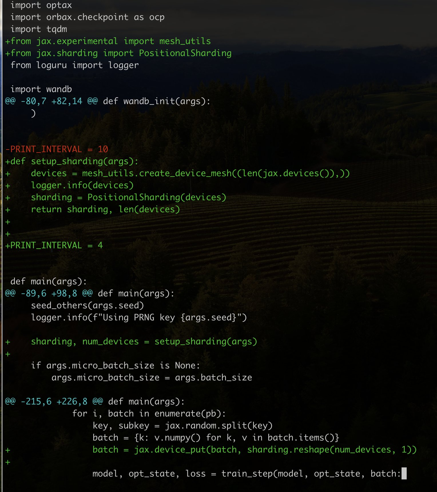

> The entire commit diff to convert the script to work with 8xTPUs.

The model's small size means it trains pretty quickly – just a few hours. Despite being small, it can struggle with overfitting, so I use a relatively high weight decay and dropout rate.

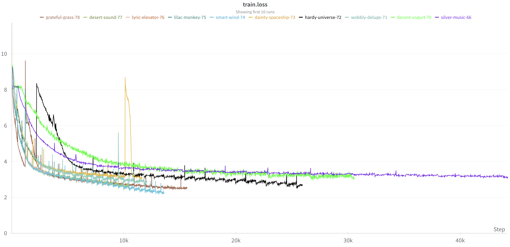

> Ooh, training curves.

### Example Samples
With the trained model, we can finally get some samples. The results are not perfect and you will probably find better results in real research work. However, not bad for a quick, hacky project, and orders of magnitude better than my previous attempts.

Next-token prediction as an objective makes sampling quite flexible, so there are a few ways to prompt the model:
- Prompting from extracts from existing music, varying the length of the prompt and the sampling temperature.
- Generating fully unconditionally with the option to vary sampling temperature.
- Conditioning on simple structures, such as chords, scales, and simple motifs.

Prompting from existing pieces involves tokenising an existing MIDI file, taking the first $N$ tokens where $N$ is a sample time parameter, and sampling the next token from the model as many times as we desire. If the amount of times to sample from the model is greater than the context length of the model, we simply drop the oldest tokens.

Naturally, prompting from real music can mean that the generated pieces tend to borrow, or copy verbatim, a lot of the prompt. This can be mitigated by using a higher sampling temperature and by limiting the number of tokens in the prompt – say 100–200 – which then tends to produce interesting results. This method of prompting is most useful for generating continuations on music you already know, which can be quite entertaining to listen to.

Below is a continuation of Gymnopédies by Erik Satie.

<video width="640" height="480" controls>
  <source src="gymnopedies.mp4" type="video/mp4">
Your browser does not support the video tag.
</video> 

On the other end of the spectrum, we have fully unconditional generation. In this case, we generate from nothing but the start token. This means there is no prompt to rely on, and the model must rely entirely on its own knowledge.

The results are naturally less consistent. Anyone who has sampled from an unprompted text model will know this. However, I was happy to know they were not all that bad, and even surprised me with the quality sometimes. This made me relieved as I could demonstrate the model was not simply copying the prompt.

Below, I show twelve unconditional samples, made up of four random seeds and three sampling:

<table>
<tr>
<th>
<figure>
  <figcaption>Seed 0 - Temperature 0.7</figcaption>
  <audio controls src="./audio/uncond-seed0-t7.mid.ogg.mp3" type="audio/mp3">
  </audio>
</figure>
</th>

<th>
<figure>
  <figcaption>Seed 0 - Temperature 0.8</figcaption>
  <audio controls src="./audio/uncond-seed0-t8.mid.ogg.mp3" type="audio/mp3">
  </audio>
</figure>
</th>

<th>
<figure>
  <figcaption>Seed 0 - Temperature 0.9</figcaption>
  <audio controls src="./audio/uncond-seed0-t9.mid.ogg.mp3" type="audio/mp3">
  </audio>
</figure>
</th>
</tr>

<tr>
<th>
<figure>
  <figcaption>Seed 11 - Temperature 0.7</figcaption>
  <audio controls src="./audio/uncond-seed11-t7.mid.ogg.mp3" type="audio/mp3">
  </audio>
</figure>
</th>

<th>
<figure>
  <figcaption>Seed 11 - Temperature 0.8</figcaption>
  <audio controls src="./audio/uncond-seed11-t8.mid.ogg.mp3" type="audio/mp3">
  </audio>
</figure>
</th>

<th>
<figure>
  <figcaption>Seed 11 - Temperature 0.9</figcaption>
  <audio controls src="./audio/uncond-seed11-t9.mid.ogg.mp3" type="audio/mp3">
  </audio>
</figure>
</th>
</tr>

<tr>
<th>
<figure>
  <figcaption>Seed 255 - Temperature 0.7</figcaption>
  <audio controls src="./audio/uncond-seed255-t7.mid.ogg.mp3" type="audio/mp3">
  </audio>
</figure>
</th>

<th>
<figure>
  <figcaption>Seed 255 - Temperature 0.8</figcaption>
  <audio controls src="./audio/uncond-seed255-t8.mid.ogg.mp3" type="audio/mp3">
  </audio>
</figure>
</th>

<th>
<figure>
  <figcaption>Seed 255 - Temperature 0.9</figcaption>
  <audio controls src="./audio/uncond-seed255-t9.mid.ogg.mp3" type="audio/mp3">
  </audio>
</figure>
</th>
</tr>

<tr>
<th>
<figure>
  <figcaption>Seed 777 - Temperature 0.7</figcaption>
  <audio controls src="./audio/uncond-seed777-t7.mid.ogg.mp3" type="audio/mp3">
  </audio>
</figure>
</th>

<th>
<figure>
  <figcaption>Seed 777 - Temperature 0.8</figcaption>
  <audio controls src="./audio/uncond-seed777-t8.mid.ogg.mp3" type="audio/mp3">
  </audio>
</figure>
</th>

<th>
<figure>
  <figcaption>Seed 777 - Temperature 0.9</figcaption>
  <audio controls src="./audio/uncond-seed777-t9.mid.ogg.mp3">
  </audio>
</figure>
</th>
</tr>

</table>

A midpoint between full unconditional sampling and prompting from files is to prompt from simple structures, such as simple chord progressions, scales, and simple motifs. This allows for a limited degree of controllable, creative generation. I didn't end up exploring this too deeply, but it is an interesting direction to expand upon.

### Conclusion
- Conclusion
	- A lot of directions that this could be continued from, such a bigger model, more advanced model (new attention types, rotary embeddings, etc), more data, and such.
	- One interesting idea would be training a model actually on the full MIDI instruction set, then letting it lose on a huge dataset to build a sort of "MIDI foundation model"
	- However, I just want this to remain a small project so I can move onto other things, so I won't be pursuing these directions.
	- But I hope I have inspired people to perhaps try their hand at creating their own MIDI generating models, perhaps on their own datasets. It is a pretty approachable learning task if you only have limited compute (this was all trained on free compute.)
